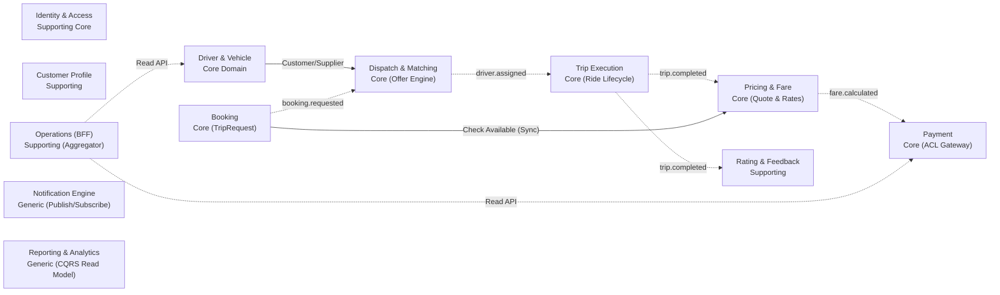
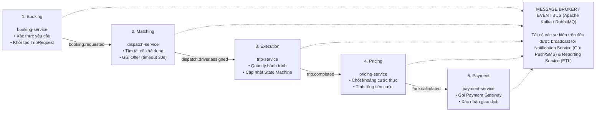
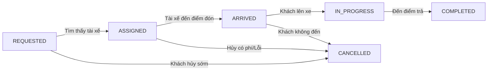
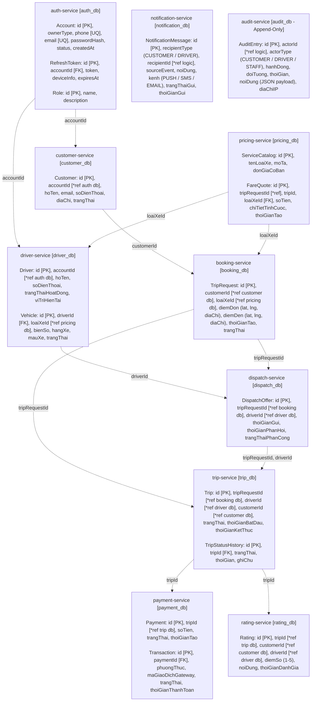

# TÀI LIỆU THIẾT KẾ KIẾN TRÚC MICROSERVICES

## HỆ THỐNG ĐẶT & ĐIỀU PHỐI XE CAB SYSTEM (DOMAIN-DRIVEN DESIGN)

**Phiên bản:** 2.0 (Toàn bộ 4 Lược đồ Kiến trúc Trực quan)  
**Kiến trúc:** Database-per-Service | Event-Driven Architecture

---

# 1. TỔNG QUAN VÀ CHIẾN LƯỢC PHÂN TÁCH DOMAIN

## 1.1. Nguyên tắc phân rã hệ thống

Tài liệu này kế thừa cấu trúc thiết kế Microservices theo chuẩn Domain-Driven Design (DDD), mở rộng và hiện thực hóa toàn bộ **19 Use Case, 46 Business Requirement và 13 thực thể nghiệp vụ** từ `srs.md`.

- **Tách rời Mobility Core:** Loại bỏ mô hình monolithic gộp chung Booking + Ride Lifecycle + Driver/Vehicle + Pricing. Bốn sub-domain này được phân tách độc lập do có chu kỳ thay đổi và yêu cầu scaling khác biệt:
  - Cập nhật vị trí tài xế: Luồng dữ liệu streaming tần suất cao (high-frequency telemetry).
  - Tiếp nhận yêu cầu Booking: Xử lý request rời rạc, tính toán tạm thời.
  - Vòng đời chuyến (Trip Execution): Quản lý State Machine nghiêm ngặt và theo dõi di chuyển thực tế.
  - Tính cước (Pricing & Fare): Quy tắc chính sách giá động, catalog loại xe.
- **Database-per-Service:** Mỗi Bounded Context sở hữu một database riêng biệt, không chia sẻ DB, không JOIN xuyên service.
- **Tích hợp Event-Driven:** Luồng nghiệp vụ xuyên miền được điều phối bất đồng bộ qua Message Broker, cô lập lỗi và đảm bảo tính sẵn sàng cao (NFR07/BR42).

## 1.2. Danh sách 13 Bounded Context sau phân tách

| STT | Bounded Context | Phân loại | Ghi chú & Năng lực vận hành |
|---|---|---|---|
| D1 | Identity & Access | Core hỗ trợ | Auth/OTP/JWT/Role cho cả 3 loại actor (Khách, Tài xế, Quản trị). |
| D2 | Customer Profile | Supporting | Quản lý hồ sơ cá nhân khách hàng, trạng thái và thông tin liên hệ. |
| D3 | Driver & Vehicle | Core | Hồ sơ tài xế, phương tiện, trạng thái sẵn sàng (AVAILABLE) & vị trí GPS. |
| D4 | Booking (Trip Request) | Core | Tiếp nhận và xác thực yêu cầu đặt xe trước khi tìm được tài xế. |
| D5 | Dispatch & Matching | Core | Tìm & phân công tài xế phù hợp, xử lý cơ chế mời/từ chối/timeout. |
| D6 | Trip Execution & Tracking | Core | Vòng đời chuyến sau khi có tài xế gán thành công đến khi kết thúc. |
| D7 | Pricing & Fare | Core | Tính cước theo chính sách doanh nghiệp, catalog loại xe/đơn giá. |
| D8 | Payment | Core | Xử lý thanh toán tiền mặt/ví điện tử, tích hợp Payment Gateway. |
| D9 | Rating & Feedback | Supporting | Khách hàng đánh giá chất lượng tài xế sau chuyến đi hoàn tất. |
| D10 | Notification | Generic | Động cơ gửi thông báo đa kênh (Push, SMS, Email). |
| D11 | Operations (BFF) | Supporting | Giao diện & API tổng hợp cho Operator (không sở hữu dữ liệu gốc). |
| D12 | Reporting & Analytics | Generic | Báo cáo/thống kê doanh thu, KPI, hiệu quả tài xế (CQRS read model). |
| D13 | Audit & Logging | Generic | Nhật ký hệ thống tập trung bất biến (append-only) cho mọi thao tác. |

---

# 2. MA TRẬN PHÂN TÁCH USE CASE THEO MIỀN NGHIỆP VỤ

| Bounded Context | Use Case liên quan | Năng lực nghiệp vụ | Khái niệm chính (Domain Entities) |
|---|---|---|---|
| Identity & Access | UC01 (auth), UC07a, UC16 | Đăng ký, xác thực OTP, JWT, thu hồi token, quản lý vai trò | Account, Credential, OTP, JWT, Role, Permission |
| Customer Profile | UC01 (hồ sơ), UC11 (đọc) | Quản lý thông tin cá nhân, cập nhật hồ sơ khách hàng | Customer, ContactInfo, CustomerStatus |
| Driver & Vehicle | UC07b, UC08, UC12, UC13 | Hồ sơ tài xế, duyệt phương tiện, cập nhật trạng thái & vị trí GPS | Driver, Vehicle, VehicleType, DriverStatus, DriverLocation |
| Booking | UC02, UC04 (tạo bản ghi) | Tiếp nhận, kiểm tra tính hợp lệ yêu cầu đặt xe | TripRequest, PickupPoint, DropoffPoint, ServiceType |
| Dispatch & Matching | UC09, UC02 (phần matching) | Tìm kiếm tài xế gần nhất, gửi đề nghị (Offer), xử lý timeout | DispatchProcess, DispatchOffer, MatchingCriteria |
| Trip Execution | UC03, UC10, UC14 | Theo dõi vòng đời chuyến từ lúc nhận đến hoàn thành | Trip, TripStatus, ETA, TripEvent, StatusHistory |
| Pricing & Fare | Ẩn trong UC02, UC05 (FR06) | Catalog loại xe/đơn giá, tính cước ước tính và thực tế | ServiceCatalog, FareRule, FareQuote, FareBreakdown |
| Payment | UC05, UC18, UC15 (đọc) | Xử lý thanh toán tiền mặt/thẻ, cổng thanh toán, hoàn tiền | Payment, PaymentMethod, Transaction, PaymentStatus |
| Rating & Feedback | UC06 | Đánh giá sao và nhận xét tài xế sau chuyến đi | Rating, Feedback, Score |
| Notification | UC19 (Consumer toàn hệ thống) | Soạn & gửi thông báo đẩy, SMS, Email cho các bên | NotificationMessage, Channel, DeliveryStatus |
| Operations (BFF) | UC11, UC12, UC13, UC14, UC17 | Giao diện tổng hợp API cho nhân viên vận hành hệ thống | OperatorView, SupportCase |
| Reporting & Analytics | UC17 | Tổng hợp số liệu doanh thu, tỷ lệ hoàn thành/hủy, hiệu quả tài xế | ReportDataMart, KPI |
| Audit & Logging | Xuyên suốt các UC | Ghi nhận, truy vết bất biến toàn bộ hành vi trong hệ thống | AuditEntry |

> **📌 LƯU Ý THIẾT KẾ VỀ UC07:** Use Case UC07 được phân rã thành UC07a (Đăng ký tài khoản tài xế - Identity & Access) và UC07b (Hồ sơ giấy tờ xe & bằng lái - Driver & Vehicle) nhằm đảm bảo nguyên tắc Single Responsibility cho mỗi service.

---

# 3. UBIQUITOUS LANGUAGE VÀ CONTEXT MAP

## 3.1. Thuật ngữ cốt lõi (Ubiquitous Language)

| Context | Thuật ngữ | Ý nghĩa nghiệp vụ chính xác |
|---|---|---|
| Identity & Access | Account | Danh tính đăng nhập hệ thống; liên kết với Customer/Driver/Staff qua accountId. |
| Identity & Access | Role / Permission | Vai trò và danh mục quyền của nhân viên vận hành hệ thống. |
| Customer Profile | Customer | Hồ sơ nghiệp vụ đầy đủ của khách hàng (tách bạch khỏi Account). |
| Driver & Vehicle | Driver Status | AVAILABLE (sẵn sàng), BUSY (đang bận), OFFLINE. Chỉ AVAILABLE mới nhận offer. |
| Booking | TripRequest | Yêu cầu đặt xe trước khi có tài xế. Có vòng đời độc lập với chuyến đi thực tế. |
| Dispatch & Matching | Offer | Một đề nghị chuyến xe gửi tới một tài xế cụ thể, có thời hạn phản hồi (TTL). |
| Trip Execution | Trip | Chuyến đi thực tế khi đã gán tài xế; State Machine: ASSIGNED → ARRIVED → PICKED_UP → COMPLETED. |
| Pricing & Fare | FareQuote | Bản chốt giá bất biến tại một thời điểm cho TripRequest/Trip làm căn cứ thanh toán. |
| Payment | Transaction | Một lần giao dịch thanh toán; một Trip có thể có nhiều Transaction nếu lần đầu thất bại. |
| Rating & Feedback | Rating | Điểm số 1-5 sao kèm nhận xét, chỉ gắn 1-1 với một Trip có trạng thái COMPLETED. |
| Audit & Logging | AuditEntry | Bản ghi bất biến (append-only) mô tả đầy đủ: Ai làm gì, lúc nào, trên đối tượng nào. |

## 3.2. Sơ đồ liên kết Bounded Context (Context Map Diagram)

Dưới đây là sơ đồ trực quan hóa mối quan hệ tích hợp giữa 13 Bounded Context theo các DDD Relationship Patterns (Customer/Supplier, Conformist, ACL, Published Language):

### Hình 3.1: Sơ đồ Context Map và các quan hệ tích hợp theo chuẩn Domain-Driven Design

> **Ghi chú:** Sơ đồ Markdown/Mermaid trên được chuyển từ sơ đồ trực quan trong tài liệu gốc; các Bounded Context không có quan hệ thể hiện bằng đường nối trong hình gốc được giữ dưới dạng node độc lập.

---

# 4. AGGREGATES VÀ INVARIANTS THEO DOMAIN

| Domain | Aggregate Root | Thành phần cốt lõi | Invariant nghiệp vụ bắt buộc (SRS BRL) |
|---|---|---|---|
| Identity & Access | Account | Credential, Role[] | Email/SĐT là duy nhất; chỉ role được cấp mới được thực hiện quyền quản trị (BRL22). |
| Customer Profile | Customer | ContactInfo, Status | Dữ liệu thông tin cá nhân phải hợp lệ trước khi lưu vết (AC49). |
| Driver & Vehicle | Driver | Vehicle, DriverStatus, Location | Chỉ được chuyển AVAILABLE khi có Vehicle hợp lệ đã duyệt (BRL05, BRL06, BRL25). |
| Booking | TripRequest | Pickup, Dropoff, ServiceType | Phải cung cấp đủ tọa độ đón/trả và loại xe mới khởi tạo yêu cầu (BRL02-BRL04). |
| Dispatch & Matching | DispatchProcess | Offer[] (mỗi offer 1 tài xế) | Chỉ đề xuất tài xế AVAILABLE gần nhất; timeout/từ chối phải tự tìm tài xế khác (BRL05, BRL09). |
| Trip Execution | Trip | TripStatus, ETA, StatusHistory | Chỉ tài xế được gán mới được chuyển trạng thái; chuyển đổi tuần tự theo quy trình (BRL12-14). |
| Pricing & Fare | FareQuote | ServiceCatalog, FareBreakdown | Cước tính chính xác theo quy tắc dịch vụ, cự ly và phụ phí giờ cao điểm (BRL15). |
| Payment | Payment | Transaction[] | Tuyệt đối không lưu dữ liệu thẻ ngân hàng nhạy cảm (BRL17); hỗ trợ thử lại khi thất bại (BRL18). |
| Rating & Feedback | Rating | Score, Comment | Chỉ được gửi đánh giá khi chuyến đi có trạng thái là COMPLETED (BRL19). |
| Notification | NotificationMessage | Channel, DeliveryStatus | Mỗi tin nhắn thông báo gắn 1 sourceEvent, có cơ chế chống phát trùng lặp tin. |
| Audit & Logging | AuditEntry | Actor, Action, Target, Payload | Bản ghi bất biến (append-only), nghiêm cấm sửa hoặc xóa vết kiểm toán (BRL23). |

---

# 5. THIẾT KẾ DOMAIN EVENTS VÀ LUỒNG ĐIỀU PHỐI (SAGA PIPELINE)

Hệ thống áp dụng kiến trúc Event-Driven Architecture (EDA) sử dụng **Apache Kafka** làm Message Broker trung tâm. Toàn bộ quy trình từ lúc khách đặt xe đến khi hoàn tất thanh toán được điều phối theo mô hình **Saga Choreography**.

## 5.1. Sơ đồ luồng sự kiện xuyên suốt (Event-Driven Saga Flow)

### Hình 5.1: Sơ đồ luồng sự kiện bất đồng bộ qua Message Broker điều phối toàn trình chuyến đi

## 5.2. Danh mục sự kiện nghiệp vụ chuẩn hóa

| Domain Event | Producer Service | Consumer Service | Mục đích nghiệp vụ |
|---|---|---|---|
| `account.registered` | Identity & Access | Customer / Driver Profile | Khởi tạo bản ghi hồ sơ rỗng sau khi tạo danh tính thành công. |
| `driver.status.changed` | Driver & Vehicle | Dispatch & Matching | Cập nhật danh sách tài xế rảnh phục vụ cho thuật toán tìm xe. |
| `driver.location.updated` | Driver & Vehicle | Dispatch & Matching, Trip | Cập nhật vị trí GPS phục vụ ghép cuốc và tính ETA thời gian thực. |
| `booking.requested` | Booking | Dispatch & Matching, Pricing | Kích hoạt tiến trình quét tìm tài xế và tính giá tạm tính ban đầu. |
| `dispatch.offer.sent` | Dispatch & Matching | Notification | Bắn thông báo đẩy cuốc xe mới đến điện thoại tài xế. |
| `dispatch.driver.assigned` | Dispatch & Matching | Trip Execution, Notification | Khởi tạo thực thể Trip, thông báo cho khách hàng đã có tài xế nhận. |
| `dispatch.no_driver_found` | Dispatch & Matching | Notification, Booking | Báo cho khách hàng hiện không có xe khả dụng sau nhiều lần thử. |
| `trip.status.changed` | Trip Execution | Notification, Reporting | Cập nhật tiến trình di chuyển lên UI khách hàng và ghi nhận thời gian. |
| `trip.completed` | Trip Execution | Pricing, Rating, Reporting | Kích hoạt tính giá cước cuối cùng và mở giao diện đánh giá chất lượng. |
| `fare.calculated` | Pricing & Fare | Payment, Notification | Chốt số tiền cước thực tế cần phải thanh toán. |
| `payment.succeeded` | Payment | Trip Execution, Notification, BI | Xác nhận hoàn tất thanh toán, gửi hóa đơn điện tử cho khách hàng. |
| `rating.submitted` | Rating & Feedback | Driver & Vehicle, Reporting | Cập nhật điểm đánh giá uy tín trung bình của tài xế. |

---

# 6. ÁNH XẠ CONTEXT SANG KIẾN TRÚC MICROSERVICES

| Bounded Context | Microservice | Database vật lý | Giao tiếp chính (Protocols) |
|---|---|---|---|
| Identity & Access | `auth-service` | `auth_db` (PostgreSQL) | REST qua Gateway; cấp JWT dùng chung cho toàn bộ service. |
| Customer Profile | `customer-service` | `customer_db` (PostgreSQL) | REST (CRUD); consume `account.registered`. |
| Driver & Vehicle | `driver-service` | `driver_db` (PostgreSQL + Redis) | REST; publish `driver.status.changed`, WebSocket vị trí GPS. |
| Booking | `booking-service` | `booking_db` (PostgreSQL) | REST (tiếp nhận); publish `booking.requested`. |
| Dispatch & Matching | `dispatch-service` | `dispatch_db` (+ Redis GEO cache) | Kafka In/Out; tính toán matching; publish `dispatch.*`. |
| Trip Execution | `trip-service` | `trip_db` (PostgreSQL) | Consume `dispatch.driver.assigned`; WebSocket; publish `trip.*`. |
| Pricing & Fare | `pricing-service` | `pricing_db` (PostgreSQL) | REST/gRPC (báo giá tức thì); consume `trip.completed`. |
| Payment | `payment-service` | `payment_db` (PostgreSQL) | Consume `fare.calculated`; REST gọi ra Payment Gateway ngoài. |
| Rating & Feedback | `rating-service` | `rating_db` (PostgreSQL) | Consume `trip.completed`; REST (submit đánh giá). |
| Notification | `notification-service` | `notification_db` (MongoDB) | Consume sự kiện nghiệp vụ; tích hợp Firebase Cloud Messaging / SMS. |
| Operations (BFF) | `operations-bff` | (Không có DB riêng, Redis Cache) | REST tổng hợp dữ liệu tới các backend services cho Web Admin. |
| Reporting & Analytics | `reporting-service` | `reporting_dw` (ClickHouse/DW) | Consume toàn bộ stream event, xây dựng Read-Model cho BI. |
| Audit & Logging | `audit-service` | `audit_db` (TimescaleDB / ES) | Consume audit events từ tất cả service, lưu trữ bất biến. |

---

# 7. MÔ TẢ CHI TIẾT TRÁCH NHIỆM DỊCH VỤ

## 7.1. Nhóm Dịch Vụ Cốt Lõi Vận Hành & State Machine Chuyến Đi

- **booking-service:** Tiếp nhận và xác thực yêu cầu đặt xe từ hành khách. Lưu vết yêu cầu dưới dạng `TripRequest`.
- **dispatch-service:** Nắm giữ thuật toán cốt lõi tìm tài xế tối ưu theo bán kính địa lý (Geo-hash/Radius). Thực hiện quy trình chào mời cuốc (Offer), quản lý bộ đếm lùi thời gian phản hồi và tự động đổi tài xế kế tiếp nếu bị từ chối hoặc quá hạn.
- **trip-service:** Quản lý máy trạng thái hữu hạn (Finite State Machine - FSM) của chuyến đi từ khi nhận cuốc đến khi hoàn tất trả khách.

### Hình 7.1: Sơ đồ State Machine quản lý các trạng thái hợp lệ của chuyến đi (Trip Lifecycle)

## 7.2. Nhóm Dịch Vụ Tài Chính, Trải Nghiệm & Hỗ Trợ

- **pricing-service:** Quản trị danh mục dịch vụ (xe 4 chỗ, 7 chỗ, xe máy...) và bảng đơn giá theo km/phút. Cung cấp báo giá ước tính cho Booking và chốt hóa đơn thực tế sau chuyến.
- **payment-service:** Xử lý giao dịch qua tiền mặt hoặc thanh toán điện tử. Đảm bảo tính an toàn giao dịch, tuân thủ PCI-DSS (không lưu thông tin thẻ nhạy cảm) và xử lý đối soát giao dịch bất đồng bộ.
- **operations-bff:** Đóng vai trò Backend-For-Frontend cho cổng điều hành Operator Portal. Thực hiện tổng hợp dữ liệu từ nhiều service để hiển thị giao diện giám sát tổng thể.

---

# 8. LƯỢC ĐỒ DỮ LIỆU TÓM TẮT (DATABASE-PER-SERVICE)

Mỗi lược đồ dưới đây độc lập hoàn toàn. Các trường đánh dấu ký hiệu `[*]` là khóa tham chiếu logic (Logical ID), không tạo Foreign Key vật lý ở cấp độ Database.

## 8.1. Sơ đồ trực quan quan hệ Logical Data Model giữa các Service

### Hình 8.1: Sơ đồ kiến trúc Database-per-Service và quan hệ tham chiếu logic — CAB System

### Quy ước

- `[PK]`: Khóa chính.
- `[FK]`: Khóa ngoại nội bộ DB.
- `[*ref]`: ID logic liên kết giữa các Microservices (không khóa ngoại vật lý).

---

# 9. CÁC VẤN ĐỀ CẦN XÁC NHẬN THÊM TRƯỚC KHI TRIỂN KHAI

1. **Quan hệ Driver – Vehicle:** Cần xác nhận là 1:1 hay 1:N (một tài xế được đăng ký nhiều xe và chọn xe chạy theo ca).
2. **Source of Truth cho ServiceCatalog:** Xác nhận pricing-service làm nguồn chân lý duy nhất (driver-service chỉ giữ bản sao dữ liệu/cache để hiển thị).
3. **Quản lý sự cố hỗ trợ khách hàng (Incident Management):** Cần làm rõ nghiệp vụ khiếu nại/sự cố chuyến đi (UC14/BR34) có cần tách thành Domain/DB riêng hay tạm tích hợp qua Operations BFF.
4. **Các tham số thuật toán Matching:** Thời gian timeout của DispatchOffer (mặc định 15s hay 30s), số lần thử tìm tài xế tối đa trước khi báo lỗi `dispatch.no_driver_found`.

---

## Ghi chú về chuyển đổi định dạng

Tài liệu Markdown này giữ nguyên nội dung nghiệp vụ, thuật ngữ, thứ tự các chương và các bảng của tài liệu gốc. Bốn sơ đồ hình ảnh trong tài liệu được chuyển thành các khối **Mermaid** để có thể copy trực tiếp vào GitHub và hiển thị dưới dạng sơ đồ.

> Lưu ý: tài liệu gốc có một số cách gọi trạng thái khác nhau giữa phần thuật ngữ và Hình 7.1. Nội dung Markdown giữ nguyên cách thể hiện của từng phần, không tự ý hiệu chỉnh nội dung nguồn.
