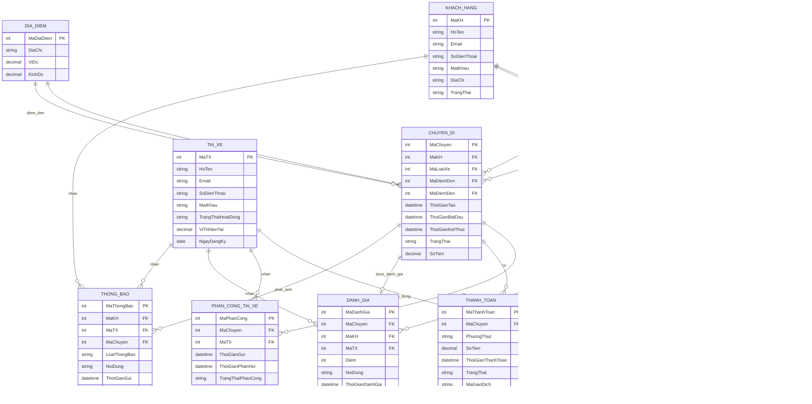
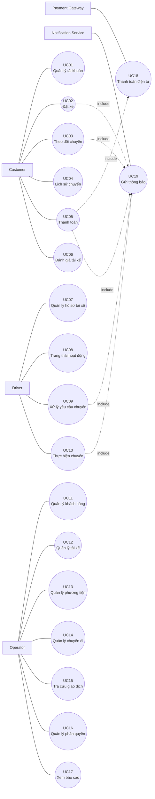

# B1. Xác định Business Context và Business Problem

## 1. Business Context – Bối cảnh nghiệp vụ

Công ty ABC đang cung cấp dịch vụ đặt xe trực tuyến thông qua tổng đài và một ứng dụng đơn giản. Tuy nhiên, doanh nghiệp đang có nhu cầu xây dựng **CAB System** mới để tự động hóa và quản lý tập trung toàn bộ quy trình đặt xe, từ khi khách hàng yêu cầu xe, tìm và phân công tài xế, thực hiện chuyến, thanh toán đến đánh giá sau chuyến.

**Đối tượng sử dụng chính:**
- Khách hàng
- Tài xế
- Nhân viên vận hành

Hệ thống cũng cần tích hợp với **cổng thanh toán điện tử và dịch vụ thông báo** bên ngoài.

## 2. Business Problem – Vấn đề nghiệp vụ

Hệ thống hiện tại tồn tại các vấn đề:

- Phân công tài xế còn **thủ công**, mất thời gian và khó tối ưu.
- Khách hàng **khó theo dõi trạng thái chuyến đi**.
- Thanh toán và giao dịch **chưa được quản lý tập trung**.
- Nhân viên vận hành gặp khó khăn trong việc **quản lý khách hàng, tài xế, chuyến đi và xử lý sự cố**.
- Khó tổng hợp dữ liệu để theo dõi **doanh thu, số chuyến, tỷ lệ hoàn thành và tỷ lệ hủy**.
- Hệ thống **khó mở rộng** khi số lượng khách hàng và tài xế tăng.

## 3. Mục tiêu kinh doanh

- Tự động hóa quy trình đặt xe và phân công tài xế.
- Nâng cao trải nghiệm và khả năng theo dõi chuyến của khách hàng.
- Quản lý tập trung chuyến đi, thanh toán và dữ liệu vận hành.
- Giảm thao tác thủ công và nâng cao hiệu quả của nhân viên.
- Xây dựng hệ thống **ổn định, bảo mật và có khả năng mở rộng**.

## 4. Giá trị của hệ thống mới

So với hệ thống cũ, CAB System giúp **tự động hóa việc tìm tài xế, theo dõi chuyến, thanh toán và thông báo**, đồng thời cung cấp dữ liệu phục vụ quản lý và báo cáo.

Hệ thống giúp **giảm thời gian xử lý, nâng cao chất lượng dịch vụ, tăng hiệu quả vận hành và tạo nền tảng để doanh nghiệp mở rộng trong tương lai**.

---

# B2. Xác định các bên liên quan (Stakeholders)

## 1. Danh sách Stakeholder và vai trò

| Stakeholder | Vai trò |
|---|---|
| Khách hàng | Đăng ký, đặt xe, theo dõi chuyến, thanh toán và đánh giá tài xế. |
| Tài xế | Nhận chuyến, chấp nhận/từ chối chuyến, thực hiện chuyến và cập nhật trạng thái. |
| Nhân viên vận hành | Quản lý khách hàng, tài xế, phương tiện, chuyến đi và xử lý sự cố. |
| Ban giám đốc | Xác định mục tiêu kinh doanh, theo dõi doanh thu và hiệu quả hoạt động. |
| Bộ phận kế toán/tài chính | Theo dõi giao dịch, thanh toán và doanh thu. |
| Nhà cung cấp thanh toán | Xử lý các giao dịch thanh toán điện tử. |
| Nhà cung cấp thông báo | Cung cấp dịch vụ gửi thông báo như SMS, Email hoặc các kênh khác. |
| Business Analyst (BA) | Thu thập, phân tích và làm rõ yêu cầu của các bên liên quan. |
| Đội phát triển hệ thống (Dev) | Thiết kế, xây dựng và triển khai hệ thống. |
| QA/Tester | Kiểm thử chức năng và phi chức năng, đảm bảo chất lượng hệ thống. |
| System Admin | Quản trị hạ tầng, vận hành kỹ thuật và bảo trì hệ thống sau triển khai. |

> *Bổ sung so với bản gốc: "QA/Tester" và "System Admin" được thêm vào danh sách vì đã được sử dụng trong ma trận stakeholder bên dưới nhưng trước đó chưa được liệt kê.*

## 2. Stakeholder Matrix

Ma trận Stakeholder được phân tích dựa trên hai tiêu chí:

- **Mức độ ảnh hưởng (Power):** Khả năng tác động đến quyết định, phạm vi, tiến độ và kết quả dự án.
- **Mức độ quan tâm (Interest):** Mức độ quan tâm của stakeholder đối với kết quả và hoạt động của hệ thống.

| MỨC ĐỘ ẢNH HƯỞNG | MỨC ĐỘ QUAN TÂM THẤP | MỨC ĐỘ QUAN TÂM CAO |
|---|---|---|
| **CAO** | Bộ phận tài chính<br>Nhà cung cấp thanh toán<br>Nhà cung cấp thông báo | Ban giám đốc<br>Nhân viên vận hành<br>System Admin<br>Business Analyst |
| **THẤP** | Stakeholder gián tiếp (các bên liên quan không trực tiếp sử dụng hệ thống, ví dụ đối tác truyền thông) | Khách hàng<br>Tài xế<br>Đội phát triển<br>QA/Tester |

### Sơ đồ Stakeholder Matrix

```text
                    MỨC ĐỘ ẢNH HƯỞNG (POWER)
                              CAO
                               │
          KEEP SATISFIED       │        MANAGE CLOSELY
                               │
          Bộ phận tài chính    │        Ban giám đốc
          Payment Provider     │        Nhân viên vận hành
          Notification         │        System Admin
          Provider              │        Business Analyst
                               │
───────────────────────────────┼──────────────────────────────
                               │
          MONITOR              │        KEEP INFORMED
                               │
          Stakeholder          │        Khách hàng
          gián tiếp            │        Tài xế
                               │        Đội phát triển
                               │        QA / Tester
                              THẤP
                    MỨC ĐỘ QUAN TÂM (INTEREST)
                         THẤP       →       CAO
```

---

# B3. Xác định Business Goals

## BG01. Tự động hóa quy trình đặt xe
- Hệ thống tự động tiếp nhận và xử lý yêu cầu đặt xe.
- Giảm thao tác thủ công của nhân viên vận hành.
- Đảm bảo quy trình từ đặt xe đến hoàn thành chuyến được xử lý xuyên suốt.

## BG02. Tự động tìm và phân công tài xế
- Hệ thống tự động tìm tài xế phù hợp.
- Ưu tiên tài xế gần khách hàng và đang sẵn sàng.
- Tự động tìm tài xế khác khi tài xế từ chối hoặc không phản hồi.
- Thông báo cho khách hàng khi tìm được hoặc không tìm được tài xế.

## BG03. Nâng cao trải nghiệm khách hàng
- Cho phép khách hàng đặt xe nhanh chóng.
- Cho phép khách hàng theo dõi trạng thái chuyến.
- Cung cấp thông tin tài xế và thời gian dự kiến đến.
- Cho phép khách hàng xem lịch sử chuyến và đánh giá tài xế.

## BG04. Nâng cao hiệu quả vận hành
- Cho phép nhân viên quản lý khách hàng, tài xế, phương tiện và chuyến đi.
- Cho phép theo dõi các chuyến đang diễn ra.
- Hỗ trợ xử lý các trường hợp chuyến bị lỗi.
- Hỗ trợ tra cứu lịch sử giao dịch.

## BG05. Quản lý tính cước và thanh toán
- Tự động xác định số tiền khách hàng phải thanh toán.
- Hỗ trợ thanh toán tiền mặt.
- Hỗ trợ thanh toán điện tử thông qua Payment Provider.
- Xử lý trường hợp thanh toán thất bại.
- Không lưu trực tiếp thông tin thanh toán nhạy cảm.

## BG06. Xây dựng hệ thống thông báo
- Thông báo cho khách hàng về các sự kiện quan trọng của chuyến.
- Thông báo cho tài xế khi có chuyến mới hoặc thay đổi chuyến.
- Cho phép mở rộng thêm các kênh thông báo trong tương lai.

## BG07. Quản lý và khai thác dữ liệu
- Lưu trữ lịch sử chuyến đi.
- Lưu trữ lịch sử giao dịch.
- Lưu trữ dữ liệu vị trí tài xế.
- Lưu vết các thao tác quan trọng.
- Hỗ trợ tra cứu và kiểm tra dữ liệu khi xảy ra sự cố.

## BG08. Hỗ trợ báo cáo và quản lý hiệu quả
- Theo dõi số lượng chuyến.
- Theo dõi doanh thu.
- Theo dõi tỷ lệ chuyến hoàn thành.
- Theo dõi tỷ lệ chuyến hủy.
- Theo dõi hiệu quả hoạt động của tài xế.

## BG09. Đảm bảo bảo mật và phân quyền
- Xác thực khách hàng, tài xế và nhân viên.
- Phân quyền chức năng quản trị.
- Bảo vệ thông tin cá nhân.
- Bảo vệ dữ liệu phương tiện, vị trí và giao dịch.
- Lưu audit log đối với các thao tác quan trọng.

## BG10. Đảm bảo tính ổn định và khả năng mở rộng
- Hệ thống hoạt động ổn định khi nhu cầu tăng cao.
- Các thành phần có khả năng mở rộng độc lập.
- Lỗi ở Payment hoặc Notification không làm toàn bộ hệ thống đặt xe ngừng hoạt động.
- Cho phép triển khai từng phần mà hạn chế ảnh hưởng đến chức năng đang hoạt động.

## BG11. Hỗ trợ phát triển hệ thống trong tương lai
- Cho phép bổ sung loại dịch vụ mới.
- Cho phép bổ sung phương thức thanh toán mới.
- Cho phép tích hợp thêm Payment Provider.
- Cho phép tích hợp thêm Notification Provider.
- Cho phép thay đổi thành phần kỹ thuật mà không phải xây dựng lại toàn bộ hệ thống.

## BG12. Hoàn thành MVP trong 7 tuần
- Xác định và ưu tiên các chức năng cốt lõi.
- Hoàn thành phiên bản MVP trong thời gian 7 tuần.
- Ưu tiên quy trình:

```text
Đặt xe → Tìm tài xế → Phân công tài xế → Thực hiện chuyến → Hoàn thành chuyến
→ Tính cước → Thanh toán → Thông báo → Đánh giá
```

---

# B4. Xác định phạm vi (Scope)

### 1. Quản lý tài khoản người dùng
- Đăng ký và đăng nhập tài khoản khách hàng.
- Quản lý thông tin cá nhân khách hàng.
- Quản lý tài khoản và hồ sơ tài xế.
- Quản lý quyền truy cập của nhân viên vận hành và quản trị viên.

### 2. Quản lý tài xế và phương tiện
- Quản lý thông tin tài xế.
- Quản lý thông tin phương tiện.
- Theo dõi trạng thái hoạt động của tài xế.
- Theo dõi vị trí của tài xế.
- Quản lý khả năng nhận chuyến của tài xế.

### 3. Đặt xe và phân công tài xế
- Nhập điểm đón và điểm đến.
- Lựa chọn loại xe.
- Tiếp nhận yêu cầu đặt xe.
- Tìm kiếm tài xế phù hợp.
- Ưu tiên tài xế dựa trên vị trí, trạng thái và tiêu chí vận hành.
- Tiếp tục tìm tài xế khác khi tài xế từ chối hoặc không phản hồi.
- Thông báo khi không tìm được tài xế.

### 4. Quản lý chuyến đi
- Theo dõi trạng thái chuyến đi.
- Cập nhật trạng thái chuyến.
- Theo dõi thời gian dự kiến tài xế đến.
- Quản lý quá trình thực hiện chuyến.
- Xử lý các trường hợp chuyến bị hủy hoặc gặp sự cố.
- Lưu lịch sử chuyến đi.

### 5. Tính cước và thanh toán
- Xác định số tiền khách hàng phải trả.
- Hỗ trợ thanh toán bằng tiền mặt.
- Hỗ trợ thanh toán điện tử/chuyển khoản.
- Tích hợp với nhà cung cấp thanh toán bên ngoài.
- Xử lý kết quả thanh toán.
- Xử lý trường hợp thanh toán thất bại.
- Lưu lịch sử giao dịch.
- Không lưu trực tiếp thông tin nhạy cảm của thẻ hoặc tài khoản thanh toán.

### 6. Thông báo
- Thông báo cho khách hàng về trạng thái đặt xe.
- Thông báo khi tài xế nhận chuyến.
- Thông báo khi tài xế đến điểm đón.
- Thông báo khi chuyến hoàn thành.
- Thông báo kết quả thanh toán.
- Thông báo cho tài xế về chuyến mới và các thay đổi liên quan đến chuyến đi.
- Hỗ trợ mở rộng thêm các kênh thông báo trong tương lai.

### 7. Đánh giá và phản hồi
- Khách hàng đánh giá tài xế sau khi hoàn thành chuyến.
- Lưu thông tin đánh giá.
- Theo dõi chất lượng phục vụ của tài xế.

### 8. Quản trị và vận hành
- Quản lý khách hàng.
- Quản lý tài xế.
- Quản lý phương tiện.
- Theo dõi các chuyến đang diễn ra.
- Kiểm tra trạng thái tài xế.
- Hỗ trợ xử lý các chuyến bị lỗi.
- Tra cứu lịch sử giao dịch.
- Phân quyền các thao tác quản trị.

### 9. Báo cáo
- Báo cáo số lượng chuyến.
- Báo cáo doanh thu.
- Báo cáo tỷ lệ chuyến hoàn thành.
- Báo cáo tỷ lệ hủy chuyến.
- Báo cáo hiệu quả hoạt động của tài xế.

### 10. Bảo mật và kiểm soát
- Xác thực người dùng.
- Phân quyền truy cập.
- Bảo vệ thông tin cá nhân.
- Bảo vệ dữ liệu phương tiện.
- Bảo vệ dữ liệu vị trí.
- Bảo vệ dữ liệu giao dịch.
- Lưu vết các thao tác quan trọng.

### 11. Những chức năng KHÔNG nên làm trong MVP

> Các chức năng dưới đây **không nằm trong phạm vi MVP 7 tuần**, có thể xem xét ở các phiên bản tiếp theo.

**11.1. Quản lý tài khoản nâng cao:** Đăng nhập Google/Facebook/Apple, MFA nâng cao, SSO, quản lý nhiều thiết bị, hệ thống thành viên nhiều cấp, chương trình Loyalty.

**11.2. Đặt xe nâng cao:** Đặt xe theo lịch, khứ hồi, nhiều điểm dừng, nhiều hành khách, Ride Sharing, đặt theo nhóm, Corporate Booking.

**11.3. Tìm và phân công tài xế nâng cao:** AI/ML dispatch, dự đoán nhu cầu theo khu vực, tối ưu nhiều chuyến cùng lúc, Dynamic Dispatch nâng cao, dự đoán ETA bằng AI.

**11.4. Tính cước nâng cao:** Dynamic Pricing, Surge Pricing, khuyến mãi/voucher phức tạp, Loyalty Discount, tối ưu giá bằng AI.

**11.5. Thanh toán nâng cao:** Tích hợp nhiều payment provider cùng lúc, ví điện tử riêng, Subscription, Auto Billing, đối soát tài chính tự động nâng cao.

**11.6. Thông báo nâng cao:** Nhiều kênh cùng lúc, Marketing/Campaign Notification, Notification Analytics nâng cao, chatbot thông báo.

**11.7. Tính năng tài xế nâng cao:** Thưởng/phạt tự động, hoa hồng phức tạp, Driver Ranking nâng cao, Gamification, phân tích hành vi lái xe bằng AI, đào tạo trực tuyến.

**11.8. Bản đồ và điều hướng nâng cao:** Tự xây bản đồ/navigation riêng, tối ưu tuyến bằng AI, heatmap và dự đoán giao thông.

**11.9. Báo cáo và phân tích nâng cao:** BI Platform, Data Warehouse phức tạp, Predictive Analytics, Custom Report Builder.

**11.10. Chăm sóc khách hàng nâng cao:** Chat trực tiếp KH–tài xế, Chatbot AI, tổng đài VoIP tích hợp, CRM Platform đầy đủ.

**11.11. Mở rộng dịch vụ:** Giao hàng, gọi xe đường dài, thuê xe theo giờ, xe hợp đồng, vận chuyển hàng hóa.

**11.12. Quản trị nâng cao:** Workflow phê duyệt nhiều cấp, Custom Role/Permission Builder, Audit Dashboard nâng cao, quản trị nhiều công ty/chi nhánh.

### 12. Các vấn đề CHƯA ĐỦ THÔNG TIN – cần BA xác nhận với khách hàng trước khi Development

- Công thức tính cước cụ thể.
- Tiêu chí ưu tiên tài xế.
- Khoảng cách tối đa để tìm tài xế.
- Thời gian tài xế phải phản hồi yêu cầu.
- Số lần hệ thống thử tìm tài xế.
- Chính sách khi tài xế từ chối/không phản hồi chuyến.
- Chính sách hủy chuyến của khách hàng/tài xế, phí hủy chuyến.
- Chính sách xử lý thanh toán thất bại.
- Quy định khi khách hàng/tài xế mất kết nối mạng.
- Tần suất cập nhật vị trí tài xế.
- Thời gian lưu trữ dữ liệu.
- Chính sách đánh giá tài xế và xử lý đánh giá không hợp lệ.
- Chi tiết phân quyền nhân viên vận hành.
- Quy định về dữ liệu cá nhân và thời gian lưu trữ dữ liệu.

### 13. Nguyên tắc Scope cho MVP

```text
                     CAB SYSTEM MVP
          ┌────────────────┼────────────────┐
          ▼                ▼                ▼
     PHẢI LÀM          CÓ THỂ LÀM        KHÔNG LÀM
      (MVP)            SAU MVP            (MVP)
          ▼                ▼                ▼
     Đặt xe           Loyalty           AI Dispatch
     Tìm tài xế       Voucher           Dynamic Pricing
     Chuyến đi        Scheduled Ride    Chatbot AI
     Tính cước        Corporate Ride    Ride Sharing
     Thanh toán       Nhiều Payment     Ví điện tử
     Thông báo        Nhiều Channel     BI nâng cao
     Đánh giá         Dịch vụ mới       Navigation riêng
     Admin            Báo cáo nâng cao  CRM đầy đủ
```

---

# B5. Chuyển đổi yêu cầu thành Business Requirements

| Mã | Tên Business Requirement | Diễn giải |
|---|---|---|
| BR01 | Quản lý tài khoản khách hàng | Hệ thống cho phép khách hàng đăng ký, đăng nhập và quản lý thông tin cá nhân. |
| BR02 | Quản lý tài khoản tài xế | Hệ thống cho phép tạo và quản lý tài khoản, hồ sơ và thông tin hoạt động của tài xế. |
| BR03 | Quản lý phương tiện | Hệ thống cho phép quản lý thông tin phương tiện được sử dụng để thực hiện chuyến đi. |
| BR04 | Quản lý quyền truy cập | Hệ thống cho phép phân quyền cho nhân viên vận hành và quản trị viên theo vai trò. |
| BR05 | Quản lý trạng thái tài xế | Hệ thống cho phép tài xế cập nhật trạng thái hoạt động và trạng thái sẵn sàng nhận chuyến. |
| BR06 | Theo dõi vị trí tài xế | Hệ thống lưu và cập nhật vị trí tài xế để phục vụ việc tìm kiếm và phân công chuyến. |
| BR07 | Tạo yêu cầu đặt xe | Hệ thống cho phép khách hàng nhập điểm đón, điểm đến và lựa chọn loại xe để tạo yêu cầu đặt xe. |
| BR08 | Tiếp nhận yêu cầu đặt xe | Hệ thống tiếp nhận và lưu thông tin yêu cầu đặt xe của khách hàng. |
| BR09 | Tự động tìm tài xế | Hệ thống tự động tìm các tài xế phù hợp dựa trên vị trí, trạng thái sẵn sàng và các tiêu chí vận hành. |
| BR10 | Ưu tiên tài xế phù hợp | Hệ thống ưu tiên tài xế phù hợp và gần khách hàng theo các tiêu chí vận hành được doanh nghiệp xác định. |
| BR11 | Xử lý tài xế từ chối hoặc không phản hồi | Hệ thống tiếp tục tìm tài xế khác khi tài xế được đề xuất từ chối hoặc không phản hồi trong thời gian quy định. |
| BR12 | Thông báo không tìm được tài xế | Hệ thống thông báo rõ ràng cho khách hàng khi không tìm được tài xế phù hợp. |
| BR13 | Phân công tài xế | Hệ thống xác nhận và gán tài xế cho chuyến đi khi tài xế chấp nhận yêu cầu. |
| BR14 | Quản lý trạng thái chuyến đi | Hệ thống quản lý và cập nhật trạng thái chuyến từ lúc tạo yêu cầu đến khi hoàn thành hoặc hủy. |
| BR15 | Theo dõi chuyến đi | Hệ thống cho phép khách hàng theo dõi trạng thái chuyến và thông tin liên quan trong quá trình thực hiện chuyến. |
| BR16 | Theo dõi thời gian dự kiến | Hệ thống cung cấp thời gian dự kiến tài xế đến điểm đón cho khách hàng. |
| BR17 | Xử lý chuyến bị hủy hoặc lỗi | Hệ thống hỗ trợ xử lý các trường hợp chuyến bị hủy hoặc gặp sự cố theo chính sách của doanh nghiệp. |
| BR18 | Lưu lịch sử chuyến đi | Hệ thống lưu trữ thông tin các chuyến đi để khách hàng và nhân viên có thể tra cứu khi cần. |
| BR19 | Tính cước chuyến đi | Hệ thống xác định số tiền khách hàng phải trả dựa trên loại dịch vụ và thông tin chuyến đi. |
| BR20 | Thanh toán tiền mặt | Hệ thống hỗ trợ ghi nhận và quản lý kết quả thanh toán bằng tiền mặt. |
| BR21 | Thanh toán điện tử | Hệ thống hỗ trợ thanh toán điện tử thông qua nhà cung cấp thanh toán bên ngoài. |
| BR22 | Quản lý kết quả thanh toán | Hệ thống tiếp nhận, lưu trữ và cập nhật trạng thái giao dịch thanh toán. |
| BR23 | Xử lý thanh toán thất bại | Hệ thống thông báo cho khách hàng khi thanh toán thất bại và hỗ trợ xử lý lại theo chính sách doanh nghiệp. |
| BR24 | Bảo vệ thông tin thanh toán | Hệ thống không lưu trực tiếp các thông tin nhạy cảm của thẻ hoặc tài khoản thanh toán. |
| BR25 | Quản lý lịch sử giao dịch | Hệ thống lưu trữ và cho phép nhân viên tra cứu lịch sử giao dịch thanh toán. |
| BR26 | Thông báo trạng thái đặt xe | Hệ thống gửi thông báo cho khách hàng khi yêu cầu đặt xe được tiếp nhận và khi trạng thái chuyến thay đổi. |
| BR27 | Thông báo cho tài xế | Hệ thống gửi thông báo cho tài xế khi có chuyến mới hoặc có thay đổi liên quan đến chuyến đang thực hiện. |
| BR28 | Mở rộng kênh thông báo | Hệ thống được thiết kế để có thể bổ sung thêm các kênh thông báo trong tương lai. |
| BR29 | Đánh giá tài xế | Hệ thống cho phép khách hàng đánh giá tài xế sau khi chuyến đi hoàn thành. |
| BR30 | Quản lý phản hồi | Hệ thống lưu trữ thông tin đánh giá và phản hồi của khách hàng đối với tài xế. |
| BR31 | Quản lý khách hàng | Hệ thống cung cấp chức năng cho nhân viên vận hành quản lý và tra cứu thông tin khách hàng. |
| BR32 | Quản lý tài xế và phương tiện | Hệ thống cung cấp chức năng cho nhân viên vận hành quản lý tài xế và phương tiện. |
| BR33 | Theo dõi chuyến đang diễn ra | Hệ thống cho phép nhân viên vận hành theo dõi các chuyến đang thực hiện và trạng thái hiện tại. |
| BR34 | Hỗ trợ xử lý sự cố | Hệ thống cho phép nhân viên vận hành kiểm tra và hỗ trợ xử lý các trường hợp chuyến bị lỗi. |
| BR35 | Báo cáo hoạt động | Hệ thống cung cấp báo cáo về số lượng chuyến, doanh thu, tỷ lệ hoàn thành và tỷ lệ hủy chuyến. |
| BR36 | Báo cáo hiệu quả tài xế | Hệ thống cung cấp dữ liệu và báo cáo để đánh giá hiệu quả hoạt động của tài xế. |
| BR37 | Xác thực người dùng | Hệ thống yêu cầu người dùng xác thực trước khi sử dụng các chức năng yêu cầu tài khoản. |
| BR38 | Kiểm soát quyền truy cập | Hệ thống kiểm soát quyền truy cập dựa trên vai trò và quyền hạn của người dùng. |
| BR39 | Bảo vệ dữ liệu | Hệ thống bảo vệ thông tin cá nhân, thông tin phương tiện, dữ liệu vị trí và dữ liệu giao dịch. |
| BR40 | Lưu vết thao tác | Hệ thống lưu lại các thao tác quan trọng của người dùng và nhân viên để phục vụ kiểm tra, truy vết khi xảy ra sự cố. |
| BR41 | Đảm bảo khả năng mở rộng | Hệ thống được thiết kế để có thể mở rộng số lượng khách hàng, tài xế và các thành phần khi nhu cầu tăng. |
| BR42 | Đảm bảo tính độc lập của các thành phần | Hệ thống hạn chế việc lỗi tại các thành phần như thanh toán hoặc thông báo làm ảnh hưởng đến toàn bộ chức năng đặt xe. |
| BR43 | Hỗ trợ triển khai từng phần | Hệ thống cho phép triển khai các chức năng mới từng phần và hạn chế ảnh hưởng đến các chức năng đang hoạt động. |
| BR44 | Hỗ trợ mở rộng dịch vụ | Kiến trúc hệ thống cho phép bổ sung các loại dịch vụ mới trong tương lai mà không phải xây dựng lại toàn bộ hệ thống. |
| BR45 | Hỗ trợ mở rộng phương thức thanh toán | Hệ thống cho phép tích hợp thêm phương thức hoặc nhà cung cấp thanh toán trong tương lai. |
| BR46 | Hỗ trợ mở rộng nhà cung cấp thông báo | Hệ thống cho phép thay đổi hoặc bổ sung nhà cung cấp thông báo mà không ảnh hưởng lớn đến hệ thống hiện tại. |

---

# B6. Xây dựng Business Process

## 1. Business Process: Đặt xe

### Mục tiêu
Quy trình cho phép khách hàng tạo yêu cầu đặt xe, hệ thống xác nhận thông tin, tìm tài xế phù hợp và xử lý trường hợp tài xế không nhận chuyến.

### Quy trình

```text
Khách hàng
    │
    ▼
Đăng nhập hệ thống
    │
    ▼
Nhập điểm đón và điểm đến
    │
    ▼
Lựa chọn loại xe / dịch vụ
    │
    ▼
Tạo yêu cầu chuyến đi
    │
    ▼
Hệ thống kiểm tra và xác nhận yêu cầu
    │
    ├──────────────┬──────────────┐
    ▼                              ▼
Không hợp lệ                    Hợp lệ
    │                              │
    ▼                              ▼
Thông báo lỗi              Tìm tài xế phù hợp
                                    │
                                    ▼
                          Có tìm thấy tài xế?
                            ╱             ╲
                        Không               Có
                          │                  │
                          ▼                  ▼
              Thông báo khách hàng    Gửi thông báo
              không tìm được tài xế   cho tài xế
                                            │
                                            ▼
                                  Tài xế chấp nhận?
                                    ╱          ╲
                                Không            Có
                                  │               │
                                  ▼               ▼
                        Tìm tài xế khác    Xác nhận chuyến
                                  │               │
                                  │               ▼
                                  │       Thông báo khách hàng
                                  │       tài xế đã nhận chuyến
                                  │               │
                                  │               ▼
                                  │        Theo dõi chuyến đi
                                  │
                                  └──────► Quay lại bước
                                          tìm tài xế phù hợp
```

## 2. Các bước chi tiết

| Bước | Tác nhân | Hoạt động | Kết quả |
|---|---|---|---|
| 1 | Khách hàng | Đăng nhập vào hệ thống | Khách hàng được xác thực |
| 2 | Khách hàng | Nhập điểm đón và điểm đến | Hệ thống nhận thông tin chuyến đi |
| 3 | Khách hàng | Lựa chọn loại xe/dịch vụ | Xác định loại dịch vụ khách hàng muốn sử dụng |
| 4 | Khách hàng | Gửi yêu cầu đặt xe | Yêu cầu đặt xe được tạo |
| 5 | Hệ thống | Kiểm tra thông tin yêu cầu | Xác định yêu cầu hợp lệ hoặc không hợp lệ |
| 6 | Hệ thống | Nếu yêu cầu không hợp lệ, thông báo lỗi cho khách hàng | Khách hàng biết thông tin cần điều chỉnh |
| 7 | Hệ thống | Nếu yêu cầu hợp lệ, bắt đầu tìm tài xế | Chuyển sang quá trình phân công tài xế |
| 8 | Hệ thống | Xác định tài xế phù hợp dựa trên vị trí, trạng thái sẵn sàng và tiêu chí vận hành | Xác định có hoặc không có tài xế phù hợp |
| 9 | Hệ thống | Nếu không tìm thấy tài xế, thông báo cho khách hàng | Khách hàng biết hệ thống chưa tìm được tài xế |
| 10 | Hệ thống | Nếu tìm thấy tài xế, gửi yêu cầu chuyến đi cho tài xế phù hợp | Tài xế nhận được thông báo |
| 11 | Tài xế | Xem thông tin chuyến đi và quyết định chấp nhận hoặc từ chối | Xác định kết quả phản hồi |
| 12 | Tài xế | Nếu từ chối hoặc không phản hồi trong thời gian quy định, hệ thống tiếp tục tìm tài xế khác | Không yêu cầu khách hàng tạo lại chuyến |
| 13 | Hệ thống | Nếu tài xế chấp nhận, xác nhận tài xế được phân công cho chuyến | Chuyến đi được xác nhận |
| 14 | Hệ thống | Thông báo cho khách hàng tài xế đã nhận chuyến | Khách hàng biết tài xế, thời gian dự kiến đến và trạng thái chuyến |
| 15 | Tài xế | Di chuyển đến điểm đón và cập nhật trạng thái | Khách hàng có thể theo dõi trạng thái chuyến |

## 3. Business Process tổng quát

**Khách hàng tạo chuyến → Hệ thống xác nhận yêu cầu → Tìm tài xế → Kiểm tra tài xế phù hợp → Gửi yêu cầu cho tài xế → Tài xế chấp nhận/từ chối → Nếu từ chối hoặc không phản hồi thì tìm tài xế khác → Nếu chấp nhận thì xác nhận chuyến → Thông báo cho khách hàng → Theo dõi chuyến đi.**

### Các trường hợp ngoại lệ
- **Không tìm thấy tài xế:** Hệ thống thông báo cho khách hàng rằng hiện chưa tìm được tài xế phù hợp.
- **Tài xế từ chối:** Hệ thống tiếp tục tìm tài xế khác mà không yêu cầu khách hàng tạo lại chuyến.
- **Tài xế không phản hồi:** Hệ thống xử lý theo thời gian phản hồi được doanh nghiệp quy định và tiếp tục tìm tài xế khác.
- **Nhiều tài xế phù hợp:** Hệ thống ưu tiên tài xế theo vị trí, trạng thái sẵn sàng và các tiêu chí vận hành.
- **Tài xế chấp nhận:** Hệ thống xác nhận tài xế, cập nhật trạng thái chuyến và thông báo cho khách hàng.

---

# B7. Thiết kế phân rã yêu cầu nghiệp vụ (Functional Requirement – FR)

## 1. Mục đích

Phân rã yêu cầu nghiệp vụ thành các **Functional Requirement (FR)** cụ thể nhằm xác định rõ các chức năng mà hệ thống CAB System cần cung cấp.

> **Lưu ý về hiệu chỉnh:** Ở bản gốc, mục này dùng lại mã "BR01–BR10" để nhóm các FR, nhưng nội dung của 10 nhóm này **khác hoàn toàn** với 46 Business Requirement (BR01–BR46) đã xác định ở B5 (trùng mã, khác nghĩa). Để tránh nhầm lẫn, 10 nhóm này được đổi tên thành **FG01–FG10 (Functional Group – Nhóm chức năng)**. Mỗi FR bên dưới sẽ được ánh xạ lại đúng vào các BR thật của B5 trong bảng ở mục 3 và trong RTM ở B14.

## 2. Cây phân rã chức năng (theo Nhóm chức năng – FG)

```text
CAB SYSTEM
│
├── FG01: Quản lý tài khoản người dùng
│   ├── FR01.01: Đăng ký tài khoản khách hàng
│   ├── FR01.02: Đăng nhập hệ thống
│   ├── FR01.03: Cập nhật thông tin cá nhân
│   └── FR01.04: Xác thực người dùng
│
├── FG02: Quản lý tài xế
│   ├── FR02.01: Tạo tài khoản tài xế
│   ├── FR02.02: Cập nhật hồ sơ tài xế
│   ├── FR02.03: Quản lý thông tin phương tiện
│   └── FR02.04: Cập nhật trạng thái hoạt động
│
├── FG03: Đặt xe
│   ├── FR03.01: Nhập điểm đón
│   ├── FR03.02: Nhập điểm đến
│   ├── FR03.03: Lựa chọn loại xe/dịch vụ
│   ├── FR03.04: Tạo yêu cầu đặt xe
│   └── FR03.05: Xác nhận yêu cầu đặt xe
│
├── FG04: Tìm kiếm và phân công tài xế
│   ├── FR04.01: Xác định tài xế phù hợp
│   ├── FR04.02: Ưu tiên tài xế gần khách hàng
│   ├── FR04.03: Gửi yêu cầu chuyến đi cho tài xế
│   ├── FR04.04: Xử lý tài xế chấp nhận chuyến
│   ├── FR04.05: Xử lý tài xế từ chối chuyến
│   ├── FR04.06: Xử lý tài xế không phản hồi
│   └── FR04.07: Tìm tài xế khác khi không được chấp nhận
│
├── FG05: Quản lý và theo dõi chuyến đi
│   ├── FR05.01: Cập nhật trạng thái chuyến đi
│   ├── FR05.02: Hiển thị thông tin tài xế
│   ├── FR05.03: Hiển thị thời gian dự kiến tài xế đến
│   ├── FR05.04: Theo dõi vị trí tài xế
│   └── FR05.05: Xem lịch sử chuyến đi
│
├── FG06: Tính cước và thanh toán
│   ├── FR06.01: Tính cước chuyến đi
│   ├── FR06.02: Hiển thị số tiền phải thanh toán
│   ├── FR06.03: Thanh toán bằng tiền mặt
│   ├── FR06.04: Thanh toán điện tử
│   ├── FR06.05: Kết nối nhà cung cấp thanh toán
│   └── FR06.06: Xử lý giao dịch thanh toán thất bại
│
├── FG07: Quản lý thông báo
│   ├── FR07.01: Thông báo tiếp nhận yêu cầu đặt xe
│   ├── FR07.02: Thông báo tài xế nhận chuyến
│   ├── FR07.03: Thông báo tài xế đến điểm đón
│   ├── FR07.04: Thông báo hoàn thành chuyến
│   ├── FR07.05: Thông báo kết quả thanh toán
│   └── FR07.06: Thông báo chuyến mới cho tài xế
│
├── FG08: Đánh giá chuyến đi
│   ├── FR08.01: Cho phép khách hàng đánh giá tài xế
│   ├── FR08.02: Ghi nhận đánh giá
│   └── FR08.03: Xem thông tin đánh giá
│
├── FG09: Quản trị và vận hành
│   ├── FR09.01: Quản lý khách hàng
│   ├── FR09.02: Quản lý tài xế
│   ├── FR09.03: Quản lý phương tiện
│   ├── FR09.04: Theo dõi các chuyến đang diễn ra
│   ├── FR09.05: Tra cứu lịch sử giao dịch
│   ├── FR09.06: Xử lý các chuyến bị lỗi
│   └── FR09.07: Phân quyền nhân viên
│
└── FG10: Báo cáo và thống kê
    ├── FR10.01: Báo cáo số lượng chuyến
    ├── FR10.02: Báo cáo doanh thu
    ├── FR10.03: Báo cáo tỷ lệ chuyến hoàn thành
    ├── FR10.04: Báo cáo tỷ lệ hủy chuyến
    └── FR10.05: Báo cáo hiệu quả hoạt động tài xế
```

## 3. Bảng ánh xạ FG → BR thật (B5) → FR

| FG | Tên nhóm chức năng | BR liên quan (B5) | FR |
|---|---|---|---|
| FG01 | Quản lý tài khoản người dùng | BR01, BR37 | FR01.01–FR01.04 |
| FG02 | Quản lý tài xế | BR02, BR03, BR05 | FR02.01–FR02.04 |
| FG03 | Đặt xe | BR07, BR08 | FR03.01–FR03.05 |
| FG04 | Tìm kiếm và phân công tài xế | BR09, BR10, BR11, BR12, BR13 | FR04.01–FR04.07 |
| FG05 | Quản lý và theo dõi chuyến đi | BR06, BR14, BR15, BR16, BR18 | FR05.01–FR05.05 |
| FG06 | Tính cước và thanh toán | BR19, BR20, BR21, BR22, BR23 | FR06.01–FR06.06 |
| FG07 | Quản lý thông báo | BR26, BR27, BR28 | FR07.01–FR07.06 |
| FG08 | Đánh giá chuyến đi | BR29, BR30 | FR08.01–FR08.03 |
| FG09 | Quản trị và vận hành | BR04, BR25, BR31, BR32, BR33, BR34, BR38 | FR09.01–FR09.07 |
| FG10 | Báo cáo và thống kê | BR35, BR36 | FR10.01–FR10.05 |

> Các BR còn lại (BR17, BR24, BR39, BR40, BR41–BR46) là các yêu cầu ở tầm **dữ liệu/kiến trúc/bảo mật/khả năng mở rộng**, không map 1-1 vào một FR cụ thể — chúng được hiện thực xuyên suốt nhiều FR và được kiểm chứng chủ yếu thông qua các **Non-Functional Requirement (NFR)** ở B10.

## 4. Bảng chi tiết Functional Requirement

| Mã FG | FG | Mã FR | Functional Requirement |
|---|---|---|---|
| FG01 | Quản lý tài khoản người dùng | FR01.01 | Hệ thống cho phép khách hàng đăng ký tài khoản. |
| FG01 | Quản lý tài khoản người dùng | FR01.02 | Hệ thống cho phép người dùng đăng nhập. |
| FG01 | Quản lý tài khoản người dùng | FR01.03 | Hệ thống cho phép người dùng cập nhật thông tin cá nhân. |
| FG01 | Quản lý tài khoản người dùng | FR01.04 | Hệ thống xác thực người dùng trước khi sử dụng chức năng yêu cầu tài khoản. |
| FG02 | Quản lý tài xế | FR02.01 | Hệ thống cho phép tài xế đăng ký hoặc nhân viên vận hành tạo tài khoản. |
| FG02 | Quản lý tài xế | FR02.02 | Hệ thống cho phép cập nhật hồ sơ tài xế. |
| FG02 | Quản lý tài xế | FR02.03 | Hệ thống cho phép quản lý thông tin phương tiện của tài xế. |
| FG02 | Quản lý tài xế | FR02.04 | Hệ thống cho phép tài xế cập nhật trạng thái sẵn sàng hoặc không sẵn sàng nhận chuyến. |
| FG03 | Đặt xe | FR03.01 | Hệ thống cho phép khách hàng nhập điểm đón. |
| FG03 | Đặt xe | FR03.02 | Hệ thống cho phép khách hàng nhập điểm đến. |
| FG03 | Đặt xe | FR03.03 | Hệ thống cho phép khách hàng lựa chọn loại xe/dịch vụ. |
| FG03 | Đặt xe | FR03.04 | Hệ thống cho phép khách hàng tạo yêu cầu đặt xe. |
| FG03 | Đặt xe | FR03.05 | Hệ thống kiểm tra và xác nhận thông tin yêu cầu đặt xe. |
| FG04 | Tìm kiếm và phân công tài xế | FR04.01 | Hệ thống xác định các tài xế phù hợp với yêu cầu chuyến đi. |
| FG04 | Tìm kiếm và phân công tài xế | FR04.02 | Hệ thống ưu tiên tài xế phù hợp và gần vị trí khách hàng. |
| FG04 | Tìm kiếm và phân công tài xế | FR04.03 | Hệ thống gửi thông báo yêu cầu chuyến đi đến tài xế được đề xuất. |
| FG04 | Tìm kiếm và phân công tài xế | FR04.04 | Hệ thống ghi nhận khi tài xế chấp nhận chuyến. |
| FG04 | Tìm kiếm và phân công tài xế | FR04.05 | Hệ thống ghi nhận khi tài xế từ chối chuyến. |
| FG04 | Tìm kiếm và phân công tài xế | FR04.06 | Hệ thống xử lý trường hợp tài xế không phản hồi. |
| FG04 | Tìm kiếm và phân công tài xế | FR04.07 | Hệ thống tiếp tục tìm tài xế khác khi tài xế được đề xuất không nhận chuyến. |
| FG05 | Quản lý và theo dõi chuyến đi | FR05.01 | Hệ thống cho phép cập nhật trạng thái chuyến đi. |
| FG05 | Quản lý và theo dõi chuyến đi | FR05.02 | Hệ thống hiển thị thông tin tài xế cho khách hàng. |
| FG05 | Quản lý và theo dõi chuyến đi | FR05.03 | Hệ thống hiển thị thời gian dự kiến tài xế đến điểm đón. |
| FG05 | Quản lý và theo dõi chuyến đi | FR05.04 | Hệ thống ghi nhận và hỗ trợ theo dõi vị trí tài xế. |
| FG05 | Quản lý và theo dõi chuyến đi | FR05.05 | Hệ thống cho phép khách hàng xem lịch sử chuyến đi. |
| FG06 | Tính cước và thanh toán | FR06.01 | Hệ thống tính số tiền phải trả dựa trên thông tin chuyến đi và loại dịch vụ. |
| FG06 | Tính cước và thanh toán | FR06.02 | Hệ thống hiển thị số tiền khách hàng phải thanh toán. |
| FG06 | Tính cước và thanh toán | FR06.03 | Hệ thống hỗ trợ thanh toán bằng tiền mặt. |
| FG06 | Tính cước và thanh toán | FR06.04 | Hệ thống hỗ trợ thanh toán điện tử. |
| FG06 | Tính cước và thanh toán | FR06.05 | Hệ thống tích hợp với nhà cung cấp dịch vụ thanh toán bên ngoài. |
| FG06 | Tính cước và thanh toán | FR06.06 | Hệ thống thông báo và xử lý lại giao dịch khi thanh toán điện tử thất bại theo chính sách doanh nghiệp. |
| FG07 | Quản lý thông báo | FR07.01 | Hệ thống thông báo khi yêu cầu đặt xe được tiếp nhận. |
| FG07 | Quản lý thông báo | FR07.02 | Hệ thống thông báo khi tài xế nhận chuyến. |
| FG07 | Quản lý thông báo | FR07.03 | Hệ thống thông báo khi tài xế đến điểm đón. |
| FG07 | Quản lý thông báo | FR07.04 | Hệ thống thông báo khi chuyến đi hoàn thành. |
| FG07 | Quản lý thông báo | FR07.05 | Hệ thống thông báo kết quả thanh toán. |
| FG07 | Quản lý thông báo | FR07.06 | Hệ thống thông báo cho tài xế khi có chuyến mới hoặc thay đổi liên quan đến chuyến đang thực hiện. |
| FG08 | Đánh giá chuyến đi | FR08.01 | Hệ thống cho phép khách hàng đánh giá tài xế sau khi hoàn thành chuyến. |
| FG08 | Đánh giá chuyến đi | FR08.02 | Hệ thống lưu trữ đánh giá của khách hàng. |
| FG08 | Đánh giá chuyến đi | FR08.03 | Hệ thống cho phép tra cứu thông tin đánh giá theo quyền được cấp. |
| FG09 | Quản trị và vận hành | FR09.01 | Nhân viên vận hành có thể quản lý thông tin khách hàng. |
| FG09 | Quản trị và vận hành | FR09.02 | Nhân viên vận hành có thể quản lý thông tin tài xế. |
| FG09 | Quản trị và vận hành | FR09.03 | Nhân viên vận hành có thể quản lý thông tin phương tiện. |
| FG09 | Quản trị và vận hành | FR09.04 | Nhân viên vận hành có thể xem và theo dõi các chuyến đang diễn ra. |
| FG09 | Quản trị và vận hành | FR09.05 | Nhân viên vận hành có thể tra cứu lịch sử giao dịch. |
| FG09 | Quản trị và vận hành | FR09.06 | Nhân viên vận hành có thể hỗ trợ xử lý các chuyến bị lỗi. |
| FG09 | Quản trị và vận hành | FR09.07 | Hệ thống cho phép phân quyền các chức năng quản trị. |
| FG10 | Báo cáo và thống kê | FR10.01 | Hệ thống cung cấp báo cáo số lượng chuyến. |
| FG10 | Báo cáo và thống kê | FR10.02 | Hệ thống cung cấp báo cáo doanh thu. |
| FG10 | Báo cáo và thống kê | FR10.03 | Hệ thống cung cấp báo cáo tỷ lệ chuyến hoàn thành. |
| FG10 | Báo cáo và thống kê | FR10.04 | Hệ thống cung cấp báo cáo tỷ lệ hủy chuyến. |
| FG10 | Báo cáo và thống kê | FR10.05 | Hệ thống cung cấp báo cáo hiệu quả hoạt động của tài xế. |

## 5. Tổng kết

Hệ thống CAB được phân rã thành **10 nhóm chức năng (FG01–FG10)**, tương ứng với **46 Business Requirement (BR01–BR46)** đã xác định ở B5, và **49 Functional Requirement (FR)**.

> **Lưu ý:** Các vấn đề như cách tính cước cụ thể, tiêu chí ưu tiên tài xế, thời gian phản hồi, chính sách hủy chuyến và xử lý mất kết nối vẫn là các nội dung cần BA xác nhận thêm với khách hàng trước khi đặc tả FR ở mức chi tiết (xem B4, mục 12).

---

# B8. Business Rules và Acceptance Criteria (cấp Business Rule)

> **Lưu ý về hiệu chỉnh:** Ở bản gốc, mục này dùng mã "AC01–AC20" trùng với mã Acceptance Criteria chi tiết ở B13 (AC01–AC48) nhưng nội dung khác nhau. Để tránh nhầm lẫn khi kiểm thử, các tiêu chí ở mục này được đổi mã thành **ACR01–ACR20 (Acceptance Criteria cấp Business Rule)**. Bộ AC chuẩn dùng cho kiểm thử UC và cho RTM là bộ **AC01–AC48 ở B13**.

## 1. Business Rules – Quy định nghiệp vụ

| Mã | Quy định nghiệp vụ |
|---|---|
| BRL01 | Khách hàng phải đăng nhập trước khi thực hiện các chức năng đặt xe. |
| BRL02 | Khách hàng phải nhập đầy đủ điểm đón và điểm đến trước khi tạo chuyến đi. |
| BRL03 | Khách hàng phải lựa chọn loại xe/dịch vụ trước khi gửi yêu cầu đặt xe. |
| BRL04 | Chuyến đi chỉ được tạo khi thông tin đặt xe hợp lệ. |
| BRL05 | Tài xế phải ở trạng thái **sẵn sàng** mới được hệ thống đề xuất nhận chuyến. |
| BRL06 | Tài xế phải có phương tiện hợp lệ và phù hợp với loại dịch vụ của chuyến đi. |
| BRL07 | Hệ thống ưu tiên tài xế phù hợp và gần vị trí khách hàng. |
| BRL08 | Tài xế có quyền chấp nhận hoặc từ chối yêu cầu chuyến đi. |
| BRL09 | Nếu tài xế từ chối chuyến, hệ thống phải tiếp tục tìm tài xế phù hợp khác. |
| BRL10 | Nếu tài xế không phản hồi trong thời gian quy định, hệ thống phải xử lý như trường hợp không nhận chuyến và tiếp tục tìm tài xế khác. |
| BRL11 | Nếu không tìm được tài xế phù hợp, hệ thống phải thông báo rõ ràng cho khách hàng. |
| BRL12 | Chỉ tài xế được phân công cho chuyến mới được phép cập nhật trạng thái của chuyến đó. |
| BRL13 | Tài xế phải cập nhật trạng thái theo đúng trình tự của chuyến đi. |
| BRL14 | Chuyến đi chỉ được chuyển sang trạng thái hoàn thành khi tài xế xác nhận đã hoàn thành chuyến. |
| BRL15 | Cước chuyến đi phải được tính dựa trên loại dịch vụ và thông tin chuyến đi theo chính sách của doanh nghiệp. |
| BRL16 | Khách hàng có thể thanh toán bằng tiền mặt hoặc phương thức thanh toán điện tử được hệ thống hỗ trợ. |
| BRL17 | Thông tin nhạy cảm của thẻ hoặc tài khoản thanh toán không được lưu trực tiếp trong hệ thống CAB. |
| BRL18 | Giao dịch thanh toán điện tử thất bại phải được thông báo cho khách hàng và xử lý lại theo chính sách doanh nghiệp. |
| BRL19 | Khách hàng chỉ được đánh giá tài xế sau khi chuyến đi hoàn thành. |
| BRL20 | Hệ thống phải gửi thông báo cho khách hàng khi có các sự kiện quan trọng của chuyến đi. |
| BRL21 | Tài xế phải nhận được thông báo khi có chuyến mới hoặc thay đổi liên quan đến chuyến đang thực hiện. |
| BRL22 | Nhân viên chỉ được thực hiện các chức năng quản trị phù hợp với quyền được cấp. |
| BRL23 | Các thao tác quản trị quan trọng phải được ghi nhận vào nhật ký hệ thống. |
| BRL24 | Dữ liệu cá nhân, dữ liệu vị trí và dữ liệu giao dịch phải được bảo vệ khỏi truy cập trái phép. |
| BRL25 | Tài xế chỉ được nhận chuyến phù hợp với loại phương tiện và trạng thái hoạt động của mình. |

## 2. Acceptance Criteria cấp Business Rule (ACR)

| Mã | Chức năng | Acceptance Criteria |
|---|---|---|
| ACR01 | Đăng nhập | Khi người dùng nhập đúng thông tin tài khoản, hệ thống cho phép đăng nhập và truy cập chức năng tương ứng. |
| ACR02 | Đăng nhập | Khi thông tin đăng nhập không hợp lệ, hệ thống từ chối đăng nhập và thông báo lỗi. |
| ACR03 | Tạo chuyến | Khi khách hàng nhập đầy đủ điểm đón, điểm đến và loại xe, hệ thống cho phép tạo yêu cầu đặt xe. |
| ACR04 | Tạo chuyến | Khi thiếu điểm đón hoặc điểm đến, hệ thống không cho phép tạo chuyến và yêu cầu khách hàng bổ sung thông tin. |
| ACR05 | Tìm tài xế | Khi có tài xế đang **sẵn sàng** và phù hợp, hệ thống gửi yêu cầu chuyến đi đến tài xế đó. |
| ACR06 | Tìm tài xế | Khi không có tài xế phù hợp, hệ thống thông báo cho khách hàng rằng chưa tìm được tài xế. |
| ACR07 | Tài xế nhận chuyến | Khi tài xế đang ở trạng thái sẵn sàng và chấp nhận chuyến, hệ thống xác nhận tài xế được phân công. |
| ACR08 | Tài xế từ chối | Khi tài xế từ chối chuyến, hệ thống tiếp tục tìm tài xế khác mà không yêu cầu khách hàng tạo lại chuyến. |
| ACR09 | Tài xế không phản hồi | Khi tài xế không phản hồi trong thời gian quy định, hệ thống chuyển sang tìm tài xế khác. |
| ACR10 | Thông báo | Khi tài xế chấp nhận chuyến, khách hàng nhận được thông báo về tài xế đã nhận chuyến. |
| ACR11 | Theo dõi chuyến | Khi tài xế cập nhật trạng thái chuyến, trạng thái mới được hiển thị cho khách hàng theo quyền được phép. |
| ACR12 | Hoàn thành chuyến | Khi tài xế xác nhận hoàn thành chuyến, hệ thống cập nhật chuyến sang trạng thái hoàn thành. |
| ACR13 | Tính cước | Khi chuyến đi hoàn thành, hệ thống tính và hiển thị số tiền khách hàng phải thanh toán. |
| ACR14 | Thanh toán | Khi thanh toán điện tử thành công, hệ thống ghi nhận giao dịch thành công và thông báo cho khách hàng. |
| ACR15 | Thanh toán thất bại | Khi thanh toán điện tử thất bại, hệ thống thông báo kết quả và cho phép xử lý lại theo chính sách doanh nghiệp. |
| ACR16 | Đánh giá | Khi chuyến đi đã hoàn thành, khách hàng có thể đánh giá tài xế. |
| ACR17 | Đánh giá | Khi chuyến đi chưa hoàn thành, hệ thống không cho phép khách hàng đánh giá tài xế. |
| ACR18 | Phân quyền | Nhân viên không có quyền quản trị không thể thực hiện các thao tác nhạy cảm. |
| ACR19 | Nhật ký | Khi người dùng thực hiện thao tác quản trị quan trọng, hệ thống ghi nhận thao tác vào nhật ký. |
| ACR20 | Bảo mật | Người dùng chưa xác thực không thể truy cập các chức năng yêu cầu đăng nhập. |

## 3. Ví dụ Business Rule → Acceptance Criteria (cấp Rule)

**Ví dụ 1 – Trạng thái tài xế**
> `BRL05: Tài xế phải ở trạng thái Sẵn sàng mới được hệ thống đề xuất nhận chuyến.`
> `ACR05: Khi hệ thống tìm tài xế, chỉ những tài xế đang ở trạng thái Sẵn sàng và phù hợp với chuyến đi mới được đưa vào danh sách đề xuất.`

**Ví dụ 2 – Tài xế từ chối chuyến**
> `BRL09: Nếu tài xế từ chối chuyến, hệ thống phải tiếp tục tìm tài xế khác.`
> `ACR08: Khi tài xế từ chối yêu cầu, hệ thống tự động tìm tài xế phù hợp tiếp theo và khách hàng không cần tạo lại yêu cầu.`

**Ví dụ 3 – Không tìm được tài xế**
> `BRL11: Nếu không tìm được tài xế phù hợp, hệ thống phải thông báo cho khách hàng.`
> `ACR06: Khi hệ thống không tìm được tài xế phù hợp, khách hàng nhận được thông báo rằng yêu cầu đặt xe chưa tìm được tài xế.`

## 4. Các Business Rule cần xác nhận thêm

| Nội dung cần xác nhận | Câu hỏi cần làm rõ |
|---|---|
| Thời gian phản hồi tài xế | Tài xế có bao nhiêu giây/phút để chấp nhận hoặc từ chối chuyến? |
| Tiêu chí ưu tiên | Hệ thống ưu tiên tài xế dựa trên khoảng cách, thời gian chờ, đánh giá hay tiêu chí nào khác? |
| Tính cước | Cước được tính dựa trên khoảng cách, thời gian, loại xe hay kết hợp nhiều yếu tố? |
| Hủy chuyến | Khách hàng và tài xế được hủy chuyến trong những trường hợp nào? |
| Phí hủy | Có áp dụng phí khi khách hàng hoặc tài xế hủy chuyến hay không? |
| Thanh toán thất bại | Khách hàng được thử thanh toán lại bao nhiêu lần? |
| Mất kết nối | Hệ thống xử lý thế nào khi khách hàng hoặc tài xế mất kết nối mạng? |
| Lưu trữ dữ liệu | Dữ liệu chuyến đi, giao dịch và nhật ký được lưu trong bao lâu? |

---

# B9. Xác định thực thể và sơ đồ ERD

## 1. Xác định các thực thể

| STT | Thực thể | Mô tả |
|---|---|---|
| 1 | **KhachHang** | Lưu thông tin tài khoản và thông tin cá nhân của khách hàng. |
| 2 | **TaiXe** | Lưu thông tin tài khoản, hồ sơ và trạng thái hoạt động của tài xế. |
| 3 | **PhuongTien** | Lưu thông tin phương tiện mà tài xế sử dụng. |
| 4 | **LoaiXe** | Lưu các loại xe/dịch vụ mà hệ thống cung cấp. |
| 5 | **ChuyenDi** | Lưu thông tin yêu cầu và quá trình thực hiện chuyến đi. |
| 6 | **DiaDiem** | Lưu thông tin điểm đón và điểm đến của chuyến đi. |
| 7 | **PhanCongTaiXe** | Lưu thông tin quá trình hệ thống tìm và phân công tài xế cho chuyến. |
| 8 | **ThanhToan** | Lưu thông tin và trạng thái thanh toán của chuyến đi. |
| 9 | **DanhGia** | Lưu đánh giá của khách hàng đối với tài xế sau chuyến đi. |
| 10 | **ThongBao** | Lưu các thông báo gửi đến khách hàng hoặc tài xế. |
| 11 | **NhanVien** | Lưu thông tin nhân viên vận hành hệ thống. |
| 12 | **VaiTro** | Lưu các vai trò và quyền hạn của nhân viên. |
| 13 | **NhatKyHeThong** | Lưu vết các thao tác quan trọng trong hệ thống. |

## 2. Các thuộc tính chính của thực thể

**KhachHang:** MaKH (PK), HoTen, Email, SoDienThoai, MatKhau, DiaChi, TrangThai

**TaiXe:** MaTX (PK), HoTen, Email, SoDienThoai, MatKhau, TrangThaiHoatDong, ViTriHienTai, NgayDangKy

**PhuongTien:** MaPT (PK), MaTX (FK), MaLoaiXe (FK), BienSo, HangXe, MauXe, TrangThai

**LoaiXe:** MaLoaiXe (PK), TenLoaiXe, MoTa, DonGiaCoBan

**ChuyenDi:** MaChuyen (PK), MaKH (FK), MaLoaiXe (FK), MaDiemDon (FK), MaDiemDen (FK), ThoiGianTao, ThoiGianBatDau, ThoiGianKetThuc, TrangThai, SoTien

**DiaDiem:** MaDiaDiem (PK), DiaChi, ViDo, KinhDo

**PhanCongTaiXe:** MaPhanCong (PK), MaChuyen (FK), MaTX (FK), ThoiGianGui, ThoiGianPhanHoi, TrangThaiPhanCong

**ThanhToan:** MaThanhToan (PK), MaChuyen (FK), PhuongThuc, SoTien, ThoiGianThanhToan, TrangThai, MaGiaoDich

**DanhGia:** MaDanhGia (PK), MaChuyen (FK), MaKH (FK), MaTX (FK), Diem, NoiDung, ThoiGianDanhGia

**ThongBao:** MaThongBao (PK), MaKH (FK, nullable), MaTX (FK, nullable), MaChuyen (FK, nullable), LoaiThongBao, NoiDung, ThoiGianGui, TrangThaiDoc

**NhanVien:** MaNV (PK), MaVaiTro (FK), HoTen, Email, MatKhau, TrangThai

**VaiTro:** MaVaiTro (PK), TenVaiTro, MoTa

**NhatKyHeThong:** MaNhatKy (PK), MaNV (FK), HanhDong, DoiTuong, ThoiGian, NoiDung, DiaChiIP

## 3. Mối quan hệ giữa các thực thể

| Thực thể 1 | Quan hệ | Thực thể 2 | Cardinality |
|---|---|---|---|
| KhachHang | tạo | ChuyenDi | 1:N |
| LoaiXe | được lựa chọn trong | ChuyenDi | 1:N |
| LoaiXe | phân loại | PhuongTien | 1:N |
| TaiXe | sở hữu/sử dụng | PhuongTien | 1:1 |
| ChuyenDi | có | DiaDiem (điểm đón) | N:1 |
| ChuyenDi | có | DiaDiem (điểm đến) | N:1 |
| ChuyenDi | có quá trình | PhanCongTaiXe | 1:N |
| TaiXe | nhận/phản hồi | PhanCongTaiXe | 1:N |
| ChuyenDi | có | ThanhToan | 1:N |
| KhachHang | thực hiện | DanhGia | 1:N |
| TaiXe | nhận | DanhGia | 1:N |
| ChuyenDi | được đánh giá | DanhGia | 1:0..1 |
| KhachHang | nhận | ThongBao | 1:N |
| TaiXe | nhận | ThongBao | 1:N |
| ChuyenDi | phát sinh | ThongBao | 1:N |
| VaiTro | được gán cho | NhanVien | 1:N |
| NhanVien | tạo | NhatKyHeThong | 1:N |

## 4. Sơ đồ ERD



## 5. Giải thích quan hệ quan trọng

**Khách hàng → Chuyến đi:** Một khách hàng có thể tạo nhiều chuyến đi, nhưng mỗi chuyến đi chỉ thuộc về một khách hàng (`1:N`).

**Chuyến đi → Phân công tài xế:** Một chuyến có thể được gửi cho nhiều tài xế lần lượt nếu tài xế trước từ chối hoặc không phản hồi — đây là quan hệ quan trọng vì phản ánh đúng Business Process ở B6 (`CHUYEN_DI (1) — (N) PHAN_CONG_TAI_XE (N) — (1) TAI_XE`).

**Chuyến đi → Thanh toán:** Một chuyến có thể phát sinh một hoặc nhiều bản ghi thanh toán trong trường hợp thanh toán thất bại và thực hiện lại (`1:N`).

**Chuyến đi → Đánh giá:** Sau khi chuyến hoàn thành, khách hàng có thể đánh giá tài xế (`1:0..1`).

**Tài xế → Phương tiện:** Mỗi tài xế sử dụng một phương tiện trong phạm vi mô hình hiện tại (`1:1`).

> **Lưu ý:** Nếu doanh nghiệp cho phép một tài xế sử dụng nhiều phương tiện, quan hệ này cần đổi thành **1:N** và bổ sung quy định phương tiện nào đang được sử dụng.

---

# B10. Non-Functional Requirements (NFR)

## 1. Danh sách yêu cầu phi chức năng

| Mã | Nhóm | Non-Functional Requirement |
|---|---|---|
| NFR01 | Hiệu năng | Hệ thống phải phản hồi các thao tác thông thường của người dùng trong thời gian phù hợp, hạn chế tình trạng chờ lâu. |
| NFR02 | Hiệu năng | Hệ thống phải có khả năng xử lý đồng thời nhiều yêu cầu đặt xe trong thời gian cao điểm. |
| NFR03 | Hiệu năng | Thông tin trạng thái chuyến đi và vị trí tài xế phải được cập nhật với độ trễ thấp. |
| NFR04 | Khả năng mở rộng | Hệ thống phải có khả năng mở rộng khi số lượng khách hàng, tài xế và chuyến đi tăng lên. |
| NFR05 | Khả năng mở rộng | Các thành phần như đặt xe, thanh toán và thông báo phải có khả năng mở rộng độc lập khi tải tăng. |
| NFR06 | Tính sẵn sàng | Hệ thống phải hoạt động ổn định và hạn chế gián đoạn trong thời gian nhu cầu đặt xe cao. |
| NFR07 | Độ tin cậy | Lỗi tại một thành phần như thanh toán hoặc thông báo không được làm toàn bộ hệ thống đặt xe ngừng hoạt động. |
| NFR08 | Khả năng phục hồi | Hệ thống phải có khả năng xử lý và phục hồi khi xảy ra lỗi kết nối hoặc lỗi từ các dịch vụ bên ngoài. |
| NFR09 | Bảo mật | Người dùng phải được xác thực trước khi truy cập các chức năng yêu cầu tài khoản. |
| NFR10 | Bảo mật | Hệ thống phải kiểm soát quyền truy cập đối với các chức năng quản trị. |
| NFR11 | Bảo mật | Thông tin cá nhân của khách hàng và tài xế phải được bảo vệ khỏi truy cập trái phép. |
| NFR12 | Bảo mật | Dữ liệu vị trí của tài xế phải được bảo vệ và chỉ cung cấp cho các đối tượng có quyền truy cập. |
| NFR13 | Bảo mật | Dữ liệu giao dịch phải được bảo vệ trong quá trình truyền và lưu trữ. |
| NFR14 | Bảo mật | Thông tin nhạy cảm của thẻ hoặc tài khoản thanh toán không được lưu trực tiếp trong hệ thống CAB. |
| NFR15 | Audit | Các thao tác quản trị và thao tác quan trọng phải được ghi lại để phục vụ kiểm tra và điều tra sự cố. |
| NFR16 | Khả năng bảo trì | Hệ thống phải có kiến trúc cho phép thay đổi hoặc nâng cấp từng thành phần mà hạn chế ảnh hưởng đến các chức năng khác. |
| NFR17 | Khả năng mở rộng chức năng | Hệ thống phải cho phép bổ sung loại dịch vụ mới mà không phải xây dựng lại toàn bộ ứng dụng. |
| NFR18 | Khả năng mở rộng chức năng | Hệ thống phải cho phép tích hợp thêm phương thức thanh toán trong tương lai. |
| NFR19 | Khả năng mở rộng chức năng | Hệ thống phải cho phép tích hợp thêm các nhà cung cấp dịch vụ thông báo. |
| NFR20 | Tương thích | Hệ thống phải có khả năng tích hợp với các dịch vụ bên ngoài như nhà cung cấp thanh toán và dịch vụ thông báo. |
| NFR21 | Triển khai | Các chức năng mới phải có thể được triển khai từng phần và hạn chế ảnh hưởng đến các chức năng đang hoạt động. |
| NFR22 | Tính toàn vẹn dữ liệu | Dữ liệu chuyến đi, thanh toán, tài xế và khách hàng phải được lưu trữ chính xác và nhất quán. |
| NFR23 | Khả năng sử dụng | Giao diện phải dễ sử dụng để khách hàng có thể nhanh chóng tạo và theo dõi chuyến đi. |
| NFR24 | Khả năng sử dụng | Giao diện vận hành phải giúp nhân viên dễ dàng theo dõi chuyến đang diễn ra, tài xế và các trường hợp lỗi. |
| NFR25 | Khả năng phục vụ | Hệ thống phải hỗ trợ số lượng lớn khách hàng và tài xế đồng thời mà vẫn duy trì hiệu năng phù hợp. |

## 2. Phân loại NFR và liên kết với BR kiến trúc (B5)

| Nhóm | NFR | BR liên quan (B5) |
|---|---|---|
| Performance | NFR01–NFR03 | — |
| Scalability | NFR04, NFR05, NFR17–NFR19 | BR41, BR44, BR45, BR46 |
| Security | NFR09–NFR14 | BR24, BR37, BR38, BR39 |
| Reliability & Availability | NFR06–NFR08 | BR17, BR42 |
| Maintainability | NFR16, NFR21 | BR43 |
| Audit & Data Integrity | NFR15, NFR22 | BR40 |
| Usability | NFR23–NFR25 | — |

## 3. Các NFR cần xác nhận với khách hàng

| Nội dung | Cần xác nhận |
|---|---|
| Thời gian phản hồi | Hệ thống phải phản hồi trong tối đa bao nhiêu giây? |
| Số người dùng đồng thời | Hệ thống cần hỗ trợ tối đa bao nhiêu khách hàng/tài xế cùng lúc? |
| Thời gian hoạt động | Hệ thống yêu cầu mức uptime bao nhiêu %? |
| Cập nhật vị trí | Vị trí tài xế cần được cập nhật mỗi bao nhiêu giây? |
| Thời gian phục hồi | Khi xảy ra lỗi, hệ thống phải phục hồi trong tối đa bao lâu? |
| Lưu trữ dữ liệu | Dữ liệu chuyến đi, giao dịch và nhật ký được lưu trong bao lâu? |
| Bảo mật | Doanh nghiệp yêu cầu những tiêu chuẩn bảo mật nào? |
| Sao lưu | Dữ liệu được sao lưu với tần suất như thế nào? |

> **Kết luận:** CAB System cần đặc biệt chú trọng **Performance, Scalability, Security, Availability, Reliability và Maintainability**, vì đây là các yếu tố trực tiếp quyết định khả năng vận hành hệ thống khi số lượng khách hàng và tài xế tăng cao.

---

# B11. Xác định và vẽ Use Case (UC)

## 1. Danh sách Use Case

Hệ thống CAB System có 3 nhóm tác nhân chính: **Customer**, **Driver**, **Operator**, và tương tác với 2 hệ thống ngoài: **Payment Gateway**, **Notification Service**.

## 2. Use Case của Customer
- **UC01 – Quản lý tài khoản khách hàng:** Đăng ký, đăng nhập, cập nhật thông tin, xác thực.
- **UC02 – Đặt xe:** Nhập điểm đón/đến, chọn loại xe, tạo và xác nhận yêu cầu.
- **UC03 – Theo dõi chuyến đi:** Xem trạng thái, thông tin tài xế, ETA, vị trí, nhận thông báo.
- **UC04 – Xem lịch sử chuyến đi:** Danh sách, chi tiết, số tiền, trạng thái thanh toán.
- **UC05 – Thanh toán chuyến đi:** Xem số tiền, chọn phương thức, thanh toán, xử lý thất bại.
- **UC06 – Đánh giá tài xế:** Đánh giá, nhập nội dung, gửi đánh giá.

## 3. Use Case của Driver
- **UC07 – Quản lý hồ sơ tài xế:** Đăng ký, đăng nhập, cập nhật thông tin cá nhân/phương tiện.
- **UC08 – Quản lý trạng thái hoạt động:** Sẵn sàng/không sẵn sàng, cập nhật vị trí.
- **UC09 – Xử lý yêu cầu chuyến đi:** Nhận thông báo, xem thông tin, chấp nhận/từ chối.
- **UC10 – Thực hiện chuyến đi:** Cập nhật các trạng thái từ đến điểm đón đến hoàn thành.

## 4. Use Case của Operator
- **UC11 – Quản lý khách hàng**
- **UC12 – Quản lý tài xế**
- **UC13 – Quản lý phương tiện**
- **UC14 – Quản lý chuyến đi**
- **UC15 – Tra cứu giao dịch**
- **UC16 – Quản lý phân quyền**
- **UC17 – Xem báo cáo**

## 5. Use Case của hệ thống bên ngoài
- **UC18 – Thanh toán điện tử** (Actor: Payment Gateway)
- **UC19 – Gửi thông báo** (Actor: Notification Service)

## 6. Sơ đồ Use Case tổng quát



## 7. Phân nhóm Use Case theo Actor

| Actor | Use Case |
|---|---|
| Customer | UC01, UC02, UC03, UC04, UC05, UC06 |
| Driver | UC07, UC08, UC09, UC10 |
| Operator | UC11, UC12, UC13, UC14, UC15, UC16, UC17 |
| Payment Gateway | UC18 |
| Notification Service | UC19 |

---

# B12. Đặc tả Use Case

## UC01 – Quản lý tài khoản khách hàng

| Thành phần | Nội dung |
|---|---|
| **Use Case ID** | UC01 |
| **Actor** | Customer |
| **Mục tiêu** | Cho phép khách hàng đăng ký, đăng nhập và cập nhật thông tin cá nhân. |
| **Tiền điều kiện** | Người dùng có quyền truy cập hệ thống. |
| **Hậu điều kiện** | Tài khoản được tạo/cập nhật và thông tin được lưu vào hệ thống. |

**Luồng chính:** Khách hàng truy cập chức năng tài khoản → chọn đăng ký/đăng nhập → nhập thông tin → hệ thống kiểm tra & xác thực → cho phép truy cập tài khoản → khách hàng cập nhật thông tin → hệ thống lưu thông tin mới.

**Luồng ngoại lệ:** Sai thông tin đăng nhập → báo lỗi. Email/SĐT đã tồn tại → yêu cầu thông tin khác. Thông tin cập nhật không hợp lệ → yêu cầu nhập lại.

## UC02 – Đặt xe

| Thành phần | Nội dung |
|---|---|
| **Use Case ID** | UC02 |
| **Actor** | Customer |
| **Mục tiêu** | Cho phép khách hàng tạo yêu cầu đặt xe. |
| **Tiền điều kiện** | Khách hàng đã đăng nhập. |
| **Hậu điều kiện** | Yêu cầu chuyến đi được tạo và chuyển sang quá trình tìm tài xế. |

**Luồng chính:** Chọn "Đặt xe" → nhập điểm đón → nhập điểm đến → chọn loại xe/dịch vụ → gửi yêu cầu → hệ thống kiểm tra → tạo chuyến đi → bắt đầu tìm tài xế → thông báo trạng thái tìm tài xế.

**Luồng ngoại lệ:** Thiếu điểm đón/đến → yêu cầu nhập lại. Không có tài xế phù hợp → thông báo. Lỗi hệ thống → yêu cầu thử lại.

## UC03 – Theo dõi chuyến đi

| Thành phần | Nội dung |
|---|---|
| **Use Case ID** | UC03 |
| **Actor** | Customer |
| **Mục tiêu** | Cho phép khách hàng theo dõi trạng thái và vị trí tài xế. |
| **Tiền điều kiện** | Khách hàng có chuyến đang được xử lý hoặc đang thực hiện. |
| **Hậu điều kiện** | Khách hàng xem được trạng thái mới nhất của chuyến. |

**Luồng chính:** Mở chuyến đang thực hiện → hiển thị trạng thái → hiển thị thông tin tài xế → hiển thị ETA → cập nhật vị trí tài xế → khách hàng theo dõi → cập nhật khi tài xế đổi trạng thái.

**Luồng ngoại lệ:** Không nhận được vị trí mới → hiển thị vị trí gần nhất. Mất kết nối → thông báo trạng thái kết nối.

## UC04 – Xem lịch sử chuyến đi

| Thành phần | Nội dung |
|---|---|
| **Use Case ID** | UC04 |
| **Actor** | Customer |
| **Mục tiêu** | Cho phép khách hàng xem các chuyến đã thực hiện. |
| **Tiền điều kiện** | Khách hàng đã đăng nhập. |
| **Hậu điều kiện** | Thông tin lịch sử chuyến được hiển thị. |

**Luồng chính:** Chọn "Lịch sử chuyến đi" → hệ thống lấy danh sách → hiển thị danh sách → chọn một chuyến → hiển thị chi tiết, số tiền, trạng thái thanh toán.

**Luồng ngoại lệ:** Không có lịch sử → hiển thị thông báo chưa có chuyến đi.

## UC05 – Thanh toán chuyến đi

| Thành phần | Nội dung |
|---|---|
| **Use Case ID** | UC05 |
| **Actor** | Customer, Payment Gateway |
| **Mục tiêu** | Cho phép khách hàng thanh toán chi phí chuyến đi. |
| **Tiền điều kiện** | Chuyến đi đã hoàn thành và hệ thống đã xác định số tiền phải trả. |
| **Hậu điều kiện** | Giao dịch được ghi nhận thành công hoặc thất bại. |

**Luồng chính:** Chuyến hoàn thành → tính cước → hiển thị số tiền → khách hàng chọn phương thức → (tiền mặt: ghi nhận / điện tử: gửi Payment Gateway) → Gateway xử lý và trả kết quả → cập nhật trạng thái → thông báo khách hàng.

**Luồng ngoại lệ:** Thanh toán thất bại → thông báo lỗi. Gateway không phản hồi → xử lý theo chính sách. Thanh toán lại → xử lý theo quy định.

## UC06 – Đánh giá tài xế

| Thành phần | Nội dung |
|---|---|
| **Use Case ID** | UC06 |
| **Actor** | Customer |
| **Mục tiêu** | Cho phép khách hàng đánh giá tài xế sau chuyến đi. |
| **Tiền điều kiện** | Chuyến đi đã hoàn thành. |
| **Hậu điều kiện** | Đánh giá được lưu vào hệ thống. |

**Luồng chính:** Mở chuyến đã hoàn thành → kiểm tra đã hoàn thành → hiển thị chức năng đánh giá → chọn điểm → nhập nhận xét → gửi đánh giá → hệ thống lưu.

**Luồng ngoại lệ:** Chuyến chưa hoàn thành → không cho đánh giá. Đã đánh giá → không cho gửi thêm theo chính sách.

## UC07 – Quản lý hồ sơ tài xế

| Thành phần | Nội dung |
|---|---|
| **Use Case ID** | UC07 |
| **Actor** | Driver, Operator |
| **Mục tiêu** | Quản lý thông tin tài khoản, hồ sơ và phương tiện của tài xế. |
| **Tiền điều kiện** | Tài xế đã được đăng ký hoặc được Operator tạo tài khoản. |
| **Hậu điều kiện** | Thông tin tài xế được lưu và cập nhật. |

**Luồng chính:** Đăng nhập → mở hồ sơ → xem thông tin → cập nhật thông tin → kiểm tra dữ liệu → lưu.

**Luồng ngoại lệ:** Thông tin không hợp lệ → yêu cầu nhập lại. Tài khoản không hợp lệ → từ chối truy cập.

## UC08 – Quản lý trạng thái hoạt động

| Thành phần | Nội dung |
|---|---|
| **Use Case ID** | UC08 |
| **Actor** | Driver |
| **Mục tiêu** | Cho phép tài xế xác định trạng thái có thể nhận chuyến. |
| **Tiền điều kiện** | Tài xế đã đăng nhập và có phương tiện hợp lệ. |
| **Hậu điều kiện** | Trạng thái tài xế được cập nhật. |

**Luồng chính:** Đăng nhập → chọn trạng thái hoạt động → chuyển sang Sẵn sàng → kiểm tra điều kiện → cập nhật trạng thái → đưa vào danh sách có thể nhận chuyến.

**Luồng ngoại lệ:** Không có phương tiện hợp lệ → không cho chuyển Sẵn sàng. Tài khoản bị khóa → không cho nhận chuyến.

## UC09 – Xử lý yêu cầu chuyến đi

| Thành phần | Nội dung |
|---|---|
| **Use Case ID** | UC09 |
| **Actor** | Driver |
| **Mục tiêu** | Cho phép tài xế nhận hoặc từ chối chuyến được hệ thống đề xuất. |
| **Tiền điều kiện** | Tài xế đang ở trạng thái sẵn sàng và phù hợp với chuyến. |
| **Hậu điều kiện** | Chuyến được tài xế nhận hoặc hệ thống tìm tài xế khác. |

**Luồng chính:** Hệ thống tìm thấy tài xế phù hợp → gửi thông báo chuyến mới → tài xế xem thông tin → chọn Chấp nhận → hệ thống xác nhận → cập nhật trạng thái chuyến → thông báo khách hàng.

**Luồng ngoại lệ:** Từ chối → tìm tài xế khác. Không phản hồi → xử lý theo thời gian quy định và tìm tài xế khác. Không còn sẵn sàng → không cho nhận chuyến.

## UC10 – Thực hiện chuyến đi

| Thành phần | Nội dung |
|---|---|
| **Use Case ID** | UC10 |
| **Actor** | Driver |
| **Mục tiêu** | Cho phép tài xế cập nhật quá trình thực hiện chuyến. |
| **Tiền điều kiện** | Tài xế đã nhận chuyến. |
| **Hậu điều kiện** | Chuyến được hoàn thành và chuyển sang bước thanh toán. |

**Luồng chính:** Nhận chuyến → di chuyển đến điểm đón → cập nhật "Đã đến điểm đón" → đón khách → cập nhật "Đã đón khách" → di chuyển → cập nhật "Đang di chuyển" → đến điểm đến → cập nhật "Hoàn thành chuyến" → hệ thống tính cước và chuyển sang thanh toán.

**Luồng ngoại lệ:** Mất kết nối → lưu trạng thái và đồng bộ lại khi khôi phục. Chuyến bị lỗi → Operator hỗ trợ xử lý.

## UC11 – Quản lý khách hàng

| Thành phần | Nội dung |
|---|---|
| **Use Case ID** | UC11 |
| **Actor** | Operator |
| **Mục tiêu** | Cho phép nhân viên vận hành quản lý thông tin khách hàng. |
| **Tiền điều kiện** | Operator đã đăng nhập và có quyền phù hợp. |
| **Hậu điều kiện** | Thông tin khách hàng được xem hoặc cập nhật. |

**Luồng chính:** Đăng nhập → chọn quản lý khách hàng → tìm kiếm → xem thông tin → thực hiện thao tác được cấp quyền → lưu thay đổi → ghi nhật ký nếu là thao tác quan trọng.

## UC12 – Quản lý tài xế

| Thành phần | Nội dung |
|---|---|
| **Use Case ID** | UC12 |
| **Actor** | Operator |
| **Mục tiêu** | Quản lý hồ sơ và trạng thái tài xế. |
| **Tiền điều kiện** | Operator đã đăng nhập và có quyền phù hợp. |
| **Hậu điều kiện** | Thông tin tài xế được cập nhật. |

**Luồng chính:** Mở quản lý tài xế → tìm kiếm → xem hồ sơ → cập nhật/tạo tài khoản theo quyền → kiểm tra thông tin → lưu dữ liệu → ghi nhật ký thao tác quan trọng.

## UC13 – Quản lý phương tiện

| Thành phần | Nội dung |
|---|---|
| **Use Case ID** | UC13 |
| **Actor** | Operator |
| **Mục tiêu** | Quản lý thông tin phương tiện phục vụ hoạt động đặt xe. |
| **Tiền điều kiện** | Operator đã đăng nhập và có quyền phù hợp. |
| **Hậu điều kiện** | Thông tin phương tiện được thêm hoặc cập nhật. |

**Luồng chính:** Chọn quản lý phương tiện → xem danh sách → thêm/chọn phương tiện → nhập/cập nhật thông tin → kiểm tra dữ liệu → lưu.

## UC14 – Quản lý chuyến đi

| Thành phần | Nội dung |
|---|---|
| **Use Case ID** | UC14 |
| **Actor** | Operator |
| **Mục tiêu** | Theo dõi và hỗ trợ xử lý các chuyến đi. |
| **Tiền điều kiện** | Operator đã đăng nhập và có quyền phù hợp. |
| **Hậu điều kiện** | Thông tin chuyến được tra cứu hoặc xử lý. |

**Luồng chính:** Mở quản lý chuyến → hiển thị các chuyến đang diễn ra → chọn một chuyến → hiển thị trạng thái và thông tin → kiểm tra/hỗ trợ xử lý → cập nhật thông tin nếu có thay đổi.

## UC15 – Tra cứu giao dịch

| Thành phần | Nội dung |
|---|---|
| **Use Case ID** | UC15 |
| **Actor** | Operator |
| **Mục tiêu** | Tra cứu lịch sử và trạng thái thanh toán. |
| **Tiền điều kiện** | Operator đã đăng nhập và có quyền truy cập. |
| **Hậu điều kiện** | Thông tin giao dịch được hiển thị. |

**Luồng chính:** Chọn tra cứu giao dịch → nhập điều kiện tìm kiếm → hệ thống tìm kiếm → hiển thị kết quả → xem chi tiết giao dịch.

## UC16 – Quản lý phân quyền

| Thành phần | Nội dung |
|---|---|
| **Use Case ID** | UC16 |
| **Actor** | Operator có quyền quản trị |
| **Mục tiêu** | Kiểm soát quyền truy cập các chức năng quản trị. |
| **Tiền điều kiện** | Người thực hiện có quyền quản trị. |
| **Hậu điều kiện** | Quyền của nhân viên được cập nhật. |

**Luồng chính:** Mở chức năng phân quyền → chọn nhân viên → chọn vai trò/quyền → kiểm tra quyền người thực hiện → lưu quyền mới → ghi nhật ký thao tác.

**Luồng ngoại lệ:** Không có quyền quản trị → từ chối thao tác. Quyền không hợp lệ → không lưu thay đổi.

## UC17 – Xem báo cáo

| Thành phần | Nội dung |
|---|---|
| **Use Case ID** | UC17 |
| **Actor** | Operator |
| **Mục tiêu** | Cung cấp dữ liệu phục vụ theo dõi hoạt động kinh doanh. |
| **Tiền điều kiện** | Operator đã đăng nhập và có quyền xem báo cáo. |
| **Hậu điều kiện** | Báo cáo được hiển thị. |

**Luồng chính:** Chọn chức năng báo cáo → chọn loại báo cáo → chọn khoảng thời gian → hệ thống tổng hợp dữ liệu → hiển thị báo cáo.

**Các báo cáo:** Số lượng chuyến, doanh thu, tỷ lệ chuyến hoàn thành, tỷ lệ hủy chuyến, hiệu quả hoạt động của tài xế.

## UC18 – Thanh toán điện tử

| Thành phần | Nội dung |
|---|---|
| **Use Case ID** | UC18 |
| **Actor** | Customer, Payment Gateway |
| **Mục tiêu** | Xử lý thanh toán điện tử cho chuyến đi. |
| **Tiền điều kiện** | Chuyến đi hoàn thành và khách hàng chọn thanh toán điện tử. |
| **Hậu điều kiện** | Hệ thống nhận được kết quả giao dịch. |

**Luồng chính:** CAB gửi yêu cầu thanh toán → Payment Gateway tiếp nhận → xử lý giao dịch → trả kết quả → CAB cập nhật trạng thái → thông báo kết quả cho khách hàng.

**Luồng ngoại lệ:** Giao dịch thất bại → thông báo thất bại. Gateway không phản hồi → xử lý theo chính sách giao dịch đang chờ. Có thể thực hiện lại theo chính sách doanh nghiệp.

## UC19 – Gửi thông báo

| Thành phần | Nội dung |
|---|---|
| **Use Case ID** | UC19 |
| **Actor** | Notification Service |
| **Mục tiêu** | Gửi thông báo đến khách hàng và tài xế. |
| **Tiền điều kiện** | Có sự kiện cần gửi thông báo. |
| **Hậu điều kiện** | Thông báo được gửi hoặc ghi nhận trạng thái gửi thất bại. |

**Luồng chính:** Hệ thống phát sinh sự kiện → tạo nội dung thông báo → gửi đến Notification Service → gửi thông báo → ghi nhận trạng thái gửi.

**Các sự kiện thông báo:** Yêu cầu đặt xe được tiếp nhận, tài xế nhận chuyến, tài xế đến điểm đón, chuyến đi hoàn thành, thanh toán thành công/thất bại, tài xế nhận chuyến mới, có thay đổi liên quan đến chuyến đang thực hiện.

---

# B13. Acceptance Criteria (AC) — bộ chuẩn dùng cho kiểm thử & RTM

## 1. Tiêu chí chấp nhận tổng quát

| Mã AC | Chức năng | Tiêu chí chấp nhận |
|---|---|---|
| AC01 | Đăng ký | Khách hàng nhập đầy đủ thông tin hợp lệ thì hệ thống tạo tài khoản thành công. |
| AC02 | Đăng ký | Nếu email hoặc số điện thoại đã tồn tại, hệ thống không cho phép tạo tài khoản trùng và phải thông báo lỗi. |
| AC03 | Đăng nhập | Người dùng nhập đúng thông tin thì được đăng nhập và truy cập chức năng theo quyền. |
| AC04 | Đăng nhập | Người dùng nhập sai thông tin thì hệ thống từ chối đăng nhập và hiển thị thông báo lỗi. |
| AC05 | Phân quyền | Người dùng không có quyền không được phép truy cập chức năng bị giới hạn. |
| AC06 | Đặt xe | Khách hàng phải đăng nhập trước khi đặt xe. |
| AC07 | Đặt xe | Khách hàng phải nhập điểm đón, điểm đến và loại xe trước khi gửi yêu cầu. |
| AC08 | Đặt xe | Khi thông tin hợp lệ, hệ thống tạo chuyến và chuyển sang trạng thái tìm tài xế. |
| AC09 | Tìm tài xế | Hệ thống chỉ tìm những tài xế đang ở trạng thái **Sẵn sàng** và phù hợp với loại xe/dịch vụ. |
| AC10 | Tìm tài xế | Hệ thống ưu tiên tài xế phù hợp và gần vị trí khách hàng theo tiêu chí doanh nghiệp quy định. |
| AC11 | Tìm tài xế | Khi tìm được tài xế, hệ thống gửi thông báo yêu cầu chuyến cho tài xế. |
| AC12 | Tìm tài xế | Khi không tìm được tài xế, hệ thống thông báo rõ ràng cho khách hàng. |
| AC13 | Tài xế nhận chuyến | Tài xế đang ở trạng thái Sẵn sàng mới được phép nhận chuyến. |
| AC14 | Tài xế nhận chuyến | Khi tài xế chấp nhận, hệ thống xác nhận tài xế được phân công và cập nhật trạng thái chuyến. |
| AC15 | Tài xế từ chối | Khi tài xế từ chối, hệ thống tự động tìm tài xế phù hợp tiếp theo. |
| AC16 | Tài xế không phản hồi | Khi tài xế không phản hồi trong thời gian quy định, hệ thống chuyển sang tìm tài xế khác. |
| AC17 | Thông báo | Khi tài xế nhận chuyến, khách hàng nhận được thông báo về tài xế và thông tin chuyến. |
| AC18 | Theo dõi | Khách hàng có thể xem trạng thái hiện tại của chuyến đi. |
| AC19 | Theo dõi | Khách hàng có thể xem thông tin tài xế và thời gian dự kiến tài xế đến. |
| AC20 | Theo dõi vị trí | Hệ thống cập nhật vị trí tài xế để hỗ trợ khách hàng theo dõi chuyến. |
| AC21 | Thực hiện chuyến | Tài xế phải cập nhật trạng thái theo quá trình thực hiện chuyến. |
| AC22 | Thực hiện chuyến | Trạng thái chuyến phải được cập nhật theo đúng quy trình nghiệp vụ. |
| AC23 | Hoàn thành chuyến | Chỉ khi tài xế xác nhận hoàn thành thì chuyến mới được chuyển sang trạng thái Hoàn thành. |
| AC24 | Tính cước | Sau khi chuyến hoàn thành, hệ thống xác định và hiển thị số tiền khách hàng phải trả. |
| AC25 | Thanh toán tiền mặt | Khi khách hàng thanh toán tiền mặt, hệ thống ghi nhận trạng thái thanh toán theo quy định. |
| AC26 | Thanh toán điện tử | Khi giao dịch điện tử thành công, hệ thống cập nhật trạng thái thanh toán thành công. |
| AC27 | Thanh toán thất bại | Khi giao dịch thất bại, hệ thống thông báo cho khách hàng và cho phép xử lý lại theo chính sách doanh nghiệp. |
| AC28 | Bảo mật thanh toán | Hệ thống CAB không lưu trực tiếp thông tin nhạy cảm của thẻ hoặc tài khoản thanh toán. |
| AC29 | Đánh giá | Khách hàng chỉ được đánh giá tài xế sau khi chuyến đã hoàn thành. |
| AC30 | Đánh giá | Hệ thống phải lưu lại đánh giá sau khi khách hàng gửi thành công. |
| AC31 | Lịch sử | Khách hàng có thể xem danh sách và chi tiết các chuyến đã thực hiện. |
| AC32 | Quản lý khách hàng | Nhân viên vận hành có quyền có thể tìm kiếm và xem thông tin khách hàng. |
| AC33 | Quản lý tài xế | Nhân viên vận hành có quyền có thể tạo, xem và cập nhật thông tin tài xế. |
| AC34 | Quản lý phương tiện | Nhân viên vận hành có quyền có thể thêm, cập nhật và tra cứu phương tiện. |
| AC35 | Quản lý chuyến | Nhân viên vận hành có thể xem các chuyến đang diễn ra và hỗ trợ xử lý chuyến lỗi. |
| AC36 | Giao dịch | Nhân viên có quyền có thể tra cứu lịch sử và trạng thái giao dịch. |
| AC37 | Phân quyền | Nhân viên thông thường không thể thực hiện các thao tác quản trị nhạy cảm nếu không được cấp quyền. |
| AC38 | Audit | Các thao tác quản trị quan trọng phải được ghi nhận vào nhật ký hệ thống. |
| AC39 | Báo cáo | Người có quyền có thể xem báo cáo số lượng chuyến, doanh thu, tỷ lệ hoàn thành và tỷ lệ hủy. |
| AC40 | Báo cáo tài xế | Hệ thống cung cấp dữ liệu để đánh giá hiệu quả hoạt động của tài xế. |
| AC41 | Thông báo | Hệ thống thông báo khi yêu cầu đặt xe được tiếp nhận. |
| AC42 | Thông báo | Hệ thống thông báo khi tài xế đến điểm đón. |
| AC43 | Thông báo | Hệ thống thông báo khi chuyến đi hoàn thành. |
| AC44 | Thông báo | Hệ thống thông báo kết quả thanh toán. |
| AC45 | Độ tin cậy | Lỗi ở dịch vụ thanh toán hoặc thông báo không được làm toàn bộ chức năng đặt xe ngừng hoạt động. |
| AC46 | Mở rộng | Có thể bổ sung phương thức thanh toán mới mà không phải xây dựng lại toàn bộ hệ thống. |
| AC47 | Mở rộng | Có thể bổ sung nhà cung cấp thông báo mới mà hạn chế ảnh hưởng đến các chức năng hiện tại. |
| AC48 | Bảo mật | Dữ liệu cá nhân, vị trí và giao dịch chỉ được truy cập bởi người có quyền. |
| AC49 | Cập nhật hồ sơ *(mới bổ sung)* | Khi khách hàng cập nhật thông tin cá nhân với dữ liệu hợp lệ, hệ thống lưu thông tin mới; nếu dữ liệu không hợp lệ, hệ thống từ chối và yêu cầu nhập lại. |

> **Ghi chú bổ sung:** Bản gốc chưa có Acceptance Criteria riêng cho chức năng "Cập nhật thông tin cá nhân" (FR01.03) — đã bổ sung **AC49** để lấp khoảng trống này (trước đây RTM gán nhầm AC05 – nội dung về phân quyền – cho FR01.03).

## 2. Tiêu chí kết thúc của quy trình đặt xe

**Trường hợp 1 – Tìm được tài xế:**
```text
Đăng nhập → Nhập điểm đón/đến → Chọn loại xe → Tạo yêu cầu → Kiểm tra yêu cầu
→ Tìm tài xế phù hợp → Gửi yêu cầu cho tài xế → Tài xế chấp nhận?
   Không → Tìm tài xế khác
   Có → Xác nhận tài xế → Thông báo khách hàng → Chuyến được xác nhận
```
Điều kiện kết thúc thành công: chuyến được tạo, tài xế phù hợp được xác định và chấp nhận, khách hàng nhận thông báo, trạng thái chuyến = "Đã xác nhận/Đã có tài xế".

**Trường hợp 2 – Không tìm được tài xế:**
```text
Tạo yêu cầu → Tìm tài xế → Không có tài xế phù hợp → Thông báo khách hàng → Kết thúc yêu cầu
```
Điều kiện kết thúc: đã thực hiện tìm tài xế theo chính sách, không có tài xế phù hợp, khách hàng được thông báo rõ ràng, không yêu cầu tạo lại nếu hệ thống còn khả năng tiếp tục tìm.

## 3. Tiêu chí kết thúc của chuyến đi

Chuyến đi hoàn thành khi: tài xế nhận chuyến → đến điểm đón → xác nhận đón khách → thực hiện chuyến → đến điểm đến → xác nhận hoàn thành → hệ thống cập nhật trạng thái "Hoàn thành" → tính cước → chuyển sang thanh toán → khách hàng nhận thông báo hoàn thành.

## 4. Tiêu chí kết thúc của thanh toán

**Thành công:** kết quả thanh toán thành công được nhận → giao dịch lưu vào hệ thống → trạng thái "Thành công" → khách hàng nhận thông báo.

**Thất bại:** kết quả thất bại được xác định → trạng thái giao dịch cập nhật → khách hàng nhận thông báo → cho phép xử lý lại nếu chính sách cho phép.

## 5. Definition of Done (toàn bộ quy trình CAB)

```text
Đặt xe → Tìm tài xế → Tài xế nhận chuyến → Thực hiện chuyến → Hoàn thành chuyến
→ Tính cước → Thanh toán → Ghi nhận giao dịch → Khách hàng đánh giá → Kết thúc
```

- [x] Khách hàng có thể tạo yêu cầu đặt xe.
- [x] Hệ thống tìm và phân công được tài xế phù hợp.
- [x] Hệ thống xử lý được trường hợp tài xế từ chối/không phản hồi.
- [x] Khách hàng theo dõi được trạng thái chuyến.
- [x] Tài xế cập nhật được trạng thái chuyến.
- [x] Hệ thống xác định được cước phí.
- [x] Hệ thống hỗ trợ thanh toán tiền mặt và điện tử.
- [x] Hệ thống xử lý được thanh toán thất bại.
- [x] Hệ thống gửi thông báo cho khách hàng và tài xế.
- [x] Khách hàng đánh giá được tài xế sau chuyến.
- [x] Nhân viên vận hành quản lý và theo dõi được hệ thống.
- [x] Hệ thống kiểm soát quyền truy cập.
- [x] Các thao tác quan trọng được ghi nhật ký.
- [x] Dữ liệu người dùng, vị trí và giao dịch được bảo vệ.
- [x] Lỗi ở một thành phần không làm toàn bộ hệ thống ngừng hoạt động.

---

# B14. Requirements Traceability Matrix (RTM)

## 1. Mục đích

RTM giúp truy xuất nguồn gốc yêu cầu, đảm bảo mỗi yêu cầu nghiệp vụ đều được chuyển thành chức năng hệ thống, mô tả bằng Use Case và có tiêu chí chấp nhận để kiểm thử:

```text
BG (Business Goal, B3) → BR (Business Requirement, B5) → FR (Functional Requirement, B7)
→ UC (Use Case, B11) → AC (Acceptance Criteria, B13)
```

> **Hiệu chỉnh quan trọng:** Bảng RTM dưới đây sử dụng đúng **12 Business Goal (BG01–BG12)** của B3 và **46 Business Requirement (BR01–BR46)** của B5 — thay cho bộ "5 BG" và "10 BR" tự phát sinh ở bản gốc (trùng mã, khác nội dung, không thể truy xuất được về đúng B3/B5).

## 2. Bảng Requirements Traceability Matrix

| BG | BR | FR | UC | AC |
|---|---|---|---|---|
| BG09 | BR01 | FR01.01 | UC01 | AC01, AC02 |
| BG09 | BR01, BR37 | FR01.02 | UC01 | AC03, AC04 |
| BG03 | BR01 | FR01.03 | UC01 | AC49 |
| BG09 | BR37 | FR01.04 | UC01 | AC03, AC05 |
| BG04 | BR02 | FR02.01 | UC07 | AC33 |
| BG04 | BR02 | FR02.02 | UC07 | AC33 |
| BG04 | BR03 | FR02.03 | UC07, UC13 | AC34 |
| BG02 | BR05 | FR02.04 | UC08 | AC13 |
| BG01, BG03 | BR07 | FR03.01 | UC02 | AC07 |
| BG01, BG03 | BR07 | FR03.02 | UC02 | AC07 |
| BG01, BG03 | BR07 | FR03.03 | UC02 | AC07 |
| BG01 | BR07 | FR03.04 | UC02 | AC06, AC08 |
| BG01 | BR08 | FR03.05 | UC02 | AC08 |
| BG02 | BR09 | FR04.01 | UC09 | AC09 |
| BG02 | BR10 | FR04.02 | UC09 | AC10 |
| BG02 | BR09 | FR04.03 | UC09 | AC11, AC12 |
| BG02 | BR13 | FR04.04 | UC09 | AC14 |
| BG02 | BR11 | FR04.05 | UC09 | AC15 |
| BG02 | BR11 | FR04.06 | UC09 | AC16 |
| BG02 | BR11, BR12 | FR04.07 | UC09 | AC15, AC16 |
| BG01 | BR14 | FR05.01 | UC03, UC10 | AC18, AC21, AC22, AC23 |
| BG03 | BR15 | FR05.02 | UC03 | AC19 |
| BG03 | BR16 | FR05.03 | UC03 | AC19 |
| BG03, BG07 | BR06 | FR05.04 | UC03, UC10 | AC20 |
| BG03, BG07 | BR18 | FR05.05 | UC04 | AC31 |
| BG05 | BR19 | FR06.01 | UC05 | AC24 |
| BG05 | BR19 | FR06.02 | UC05 | AC24 |
| BG05 | BR20 | FR06.03 | UC05 | AC25 |
| BG05 | BR21 | FR06.04 | UC05 | AC26 |
| BG05, BG11 | BR21, BR22 | FR06.05 | UC18 | AC26, AC28 |
| BG05 | BR23 | FR06.06 | UC05, UC18 | AC27 |
| BG06 | BR26 | FR07.01 | UC19 | AC41 |
| BG06 | BR26 | FR07.02 | UC19 | AC17 |
| BG06 | BR26 | FR07.03 | UC19 | AC42 |
| BG06 | BR26 | FR07.04 | UC19 | AC43 |
| BG06 | BR26 | FR07.05 | UC19 | AC44 |
| BG06 | BR27 | FR07.06 | UC19 | AC11 |
| BG03 | BR29 | FR08.01 | UC06 | AC29 |
| BG03 | BR30 | FR08.02 | UC06 | AC30 |
| BG03 | BR30 | FR08.03 | UC06 | AC30 |
| BG04 | BR31 | FR09.01 | UC11 | AC32 |
| BG04 | BR32 | FR09.02 | UC12 | AC33 |
| BG04 | BR32 | FR09.03 | UC13 | AC34 |
| BG04 | BR33 | FR09.04 | UC14 | AC35 |
| BG04, BG07 | BR25 | FR09.05 | UC15 | AC36 |
| BG04 | BR34, BR17 | FR09.06 | UC14 | AC35 |
| BG09 | BR04, BR38 | FR09.07 | UC16 | AC37, AC38 |
| BG08 | BR35 | FR10.01 | UC17 | AC39 |
| BG08 | BR35 | FR10.02 | UC17 | AC39 |
| BG08 | BR35 | FR10.03 | UC17 | AC39 |
| BG08 | BR35 | FR10.04 | UC17 | AC39 |
| BG08 | BR36 | FR10.05 | UC17 | AC40 |

### 2.1. Các Business Requirement thuộc tầm kiến trúc / phi chức năng (không có FR/UC/AC riêng)

Các BR sau được hiện thực xuyên suốt kiến trúc hệ thống và được kiểm chứng qua **NFR (B10)** và đánh giá kiến trúc, thay vì qua một FR/UC/AC cụ thể:

| BG | BR | Diễn giải | Kiểm chứng qua |
|---|---|---|---|
| BG05 | BR24 | Bảo vệ thông tin thanh toán | NFR14, AC28 |
| BG09 | BR39 | Bảo vệ dữ liệu cá nhân/vị trí/giao dịch | NFR11–NFR13, AC48 |
| BG09 | BR40 | Lưu vết thao tác quan trọng | NFR15, AC38 |
| BG10 | BR41 | Đảm bảo khả năng mở rộng | NFR04, NFR25 |
| BG10 | BR42 | Đảm bảo tính độc lập của các thành phần | NFR07, AC45 |
| BG10 | BR43 | Hỗ trợ triển khai từng phần | NFR16, NFR21 |
| BG11 | BR44 | Hỗ trợ mở rộng dịch vụ | NFR17 |
| BG11 | BR45 | Hỗ trợ mở rộng phương thức thanh toán | NFR18, AC46 |
| BG11 | BR46 | Hỗ trợ mở rộng nhà cung cấp thông báo | NFR19, AC47 |

## 3. Kiểm tra tính truy xuất

### Chiều thuận
```text
BG01 → BR07 → FR03.04 → UC02 → AC08
```
> **BG01:** Tự động hóa quy trình đặt xe → **BR07:** Tạo yêu cầu đặt xe → **FR03.04:** Hệ thống cho phép khách hàng tạo yêu cầu đặt xe → **UC02:** Đặt xe → **AC08:** Khi thông tin hợp lệ, hệ thống tạo chuyến và chuyển sang trạng thái tìm tài xế.

### Chiều ngược
```text
AC15 → UC09 → FR04.05 → BR11 → BG02
```
> **AC15:** Khi tài xế từ chối chuyến, hệ thống tự động tìm tài xế khác → **UC09:** Xử lý yêu cầu chuyến đi → **FR04.05:** Xử lý tài xế từ chối chuyến → **BR11:** Xử lý tài xế từ chối hoặc không phản hồi → **BG02:** Tự động tìm và phân công tài xế.

## 4. Kết luận

RTM (đã hiệu chỉnh) đảm bảo:
- Mỗi **Business Goal (BG01–BG12, B3)** đều được cụ thể hóa thành các **Business Requirement (BR01–BR46, B5)**.
- Mỗi Business Requirement có chức năng đều có **Functional Requirement (B7)** tương ứng; các BR thuộc tầm kiến trúc/phi chức năng được kiểm chứng qua **NFR (B10)**.
- Các FR đều được thể hiện trong **Use Case (B11)**.
- Các UC đều có **Acceptance Criteria (B13)** để kiểm thử.
- Có thể truy xuất **hai chiều** từ mục tiêu kinh doanh xuống kiểm thử và ngược lại, không còn tình trạng trùng mã khác nghĩa giữa các phần.

```text
Business Goal → Business Requirement → Functional Requirement → Use Case → Acceptance Criteria → Testing
```
